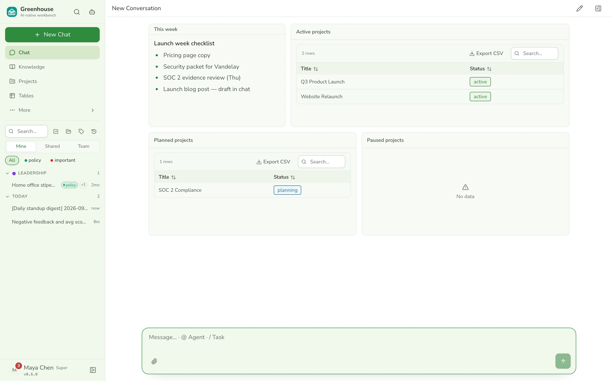
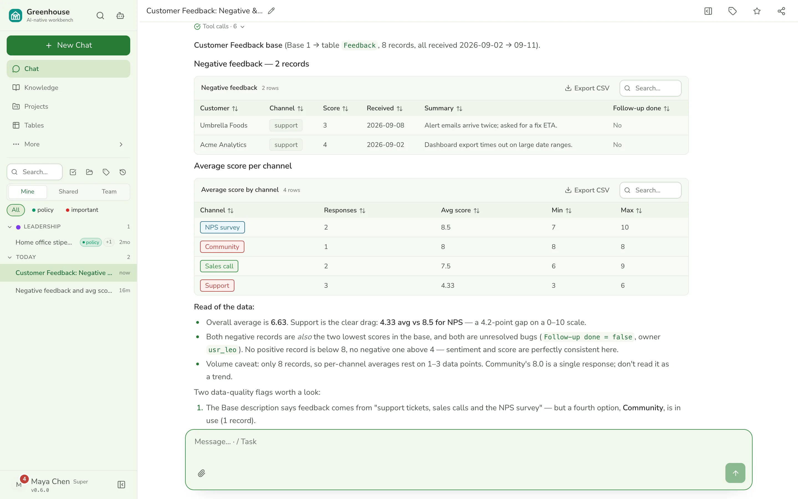
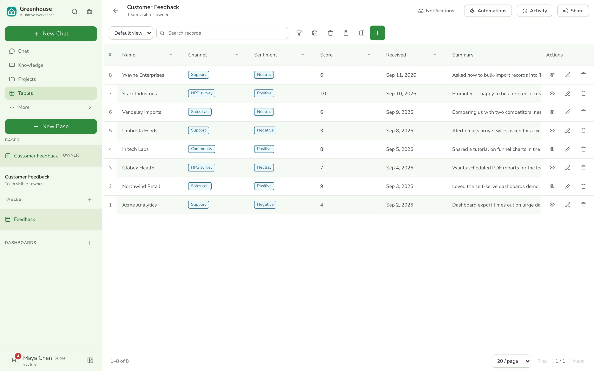
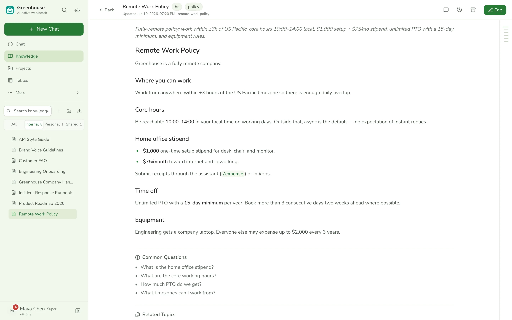
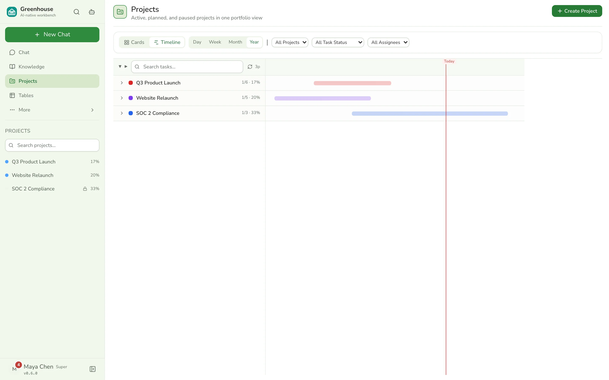
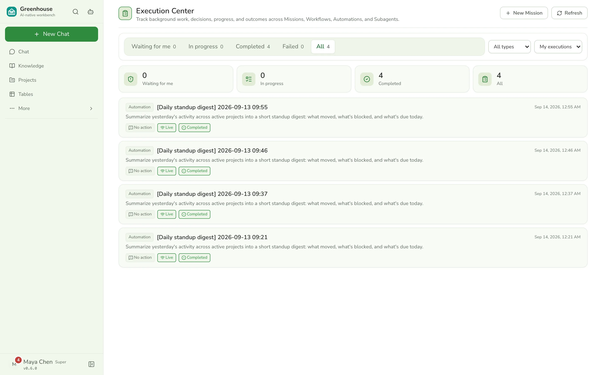
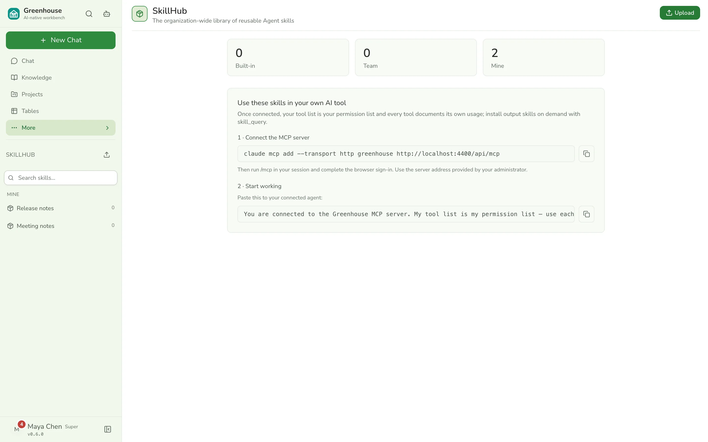
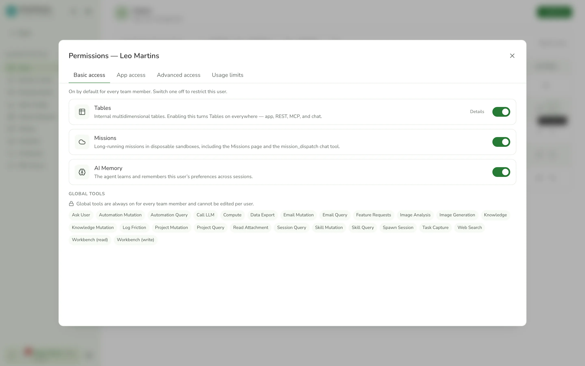
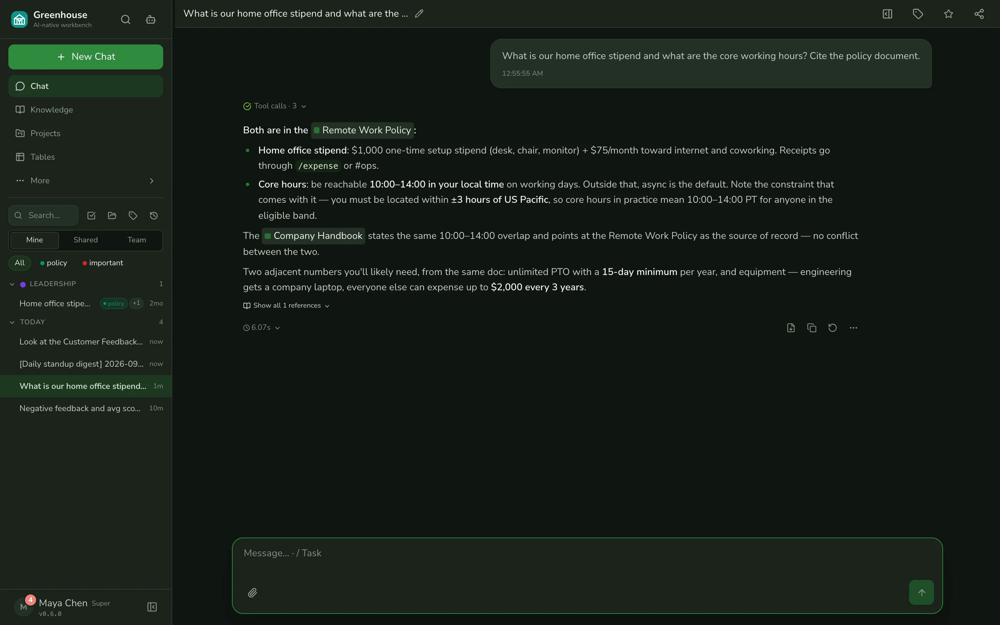
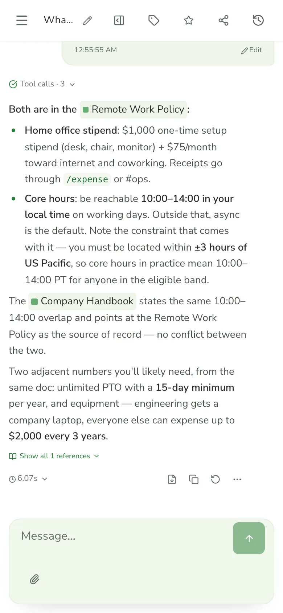

<p align="center">
  
</p>

<p align="center">
  <a href="https://greenhouse.linjiejim.com"></a>
  <a href="./LICENSE"></a>
  <a href="https://github.com/linjiejim/greenhouse/releases/latest"></a>
  <a href="https://github.com/linjiejim/greenhouse/actions/workflows/ci.yml"></a>
  <a href="https://github.com/linjiejim/greenhouse/stargazers"></a>
</p>

**An open-source, AI-native enterprise agent workbench.** One command to self-host, members
log in with accounts (no app to install), and every capability is also callable by external
agents over [MCP](https://modelcontextprotocol.io/). Admins author tools in code that
auto-expose over chat, `/api/agent`, and `/api/mcp` — add a tool by writing one file.

Greenhouse is built around the idea that the agent *is* the product, not a feature bolted on
the side. Chat, the knowledge base, projects, tables, automations, missions and email all share
one tool layer and one permission model; the same tools your team uses in chat are the ones you
expose to Claude, Cursor, or any MCP client.

## A quick look

<p align="center">
  
</p>
<p align="center"><sub>Grounded answers: the agent searches the team knowledge base, cites the policy document, and the trace shows every tool call.</sub></p>

<table>
  <tr>
    <td width="50%" valign="top">
      
      <b>Home workbench</b> — live cards backed by the same tools; edit by drag-and-drop or ask the agent.
    </td>
    <td width="50%" valign="top">
      
      <b>Data in chat</b> — the agent queries a Tables base and answers with sortable, exportable tables.
    </td>
  </tr>
  <tr>
    <td width="50%" valign="top">
      
      <b>Tables</b> — typed fields, views, forms and record links; the agent plans schemas conversationally.
    </td>
    <td width="50%" valign="top">
      
      <b>Knowledge base</b> — team, personal and shared documents with backlinks and full-text search.
    </td>
  </tr>
  <tr>
    <td width="50%" valign="top">
      
      <b>Projects</b> — portfolio timeline, boards and task trees with members, comments and activity.
    </td>
    <td width="50%" valign="top">
      
      <b>Execution center</b> — automations, missions, workflows and sub-agents in one place, with an approval inbox.
    </td>
  </tr>
  <tr>
    <td width="50%" valign="top">
      
      <b>Skill Center</b> — versioned SKILL.md bundles with changelogs and security scanning.
    </td>
    <td width="50%" valign="top">
      
      <b>One permissions dialog</b> — roles, capabilities and feature flags, enforced once for HTTP, chat, the proxy and MCP.
    </td>
  </tr>
</table>

<p align="center">
  
  
</p>
<p align="center"><sub>Light / dark / system themes and a responsive layout; the <a href="apps/mobile">Expo app</a> covers chat, knowledge and projects natively.</sub></p>

Every image above is produced by `node scripts/capture-screens.mjs` against a seeded dev stack — the
same script doubles as an end-to-end smoke tour (see [Development](#development)).

## Features

- **Chat** — streaming agent with tool-call traces, attachments of any file type (the agent
  reads text / CSV / JSON / xlsx / docx / PDF), per-turn model switching from a config catalog,
  a side pane for artifacts and records, session forking, background runs, sharing / grouping /
  tagging, and a global ⌘P search.
- **Knowledge Base** — team, personal and shared documents with a Tiptap editor, Markdown-first
  storage, folders plus a file cabinet, backlinks, comments and @-mentions, templates, version
  history, fine-grained sharing via groups, and segmented full-text search (CJK-aware).
- **Projects** — projects, tasks (board / gantt / tree views), members, comments, activity log.
- **Tables** — multidimensional bases: typed fields, views, forms, record links, dashboards,
  rule automations, and conversational schema planning (the agent drafts a base, you confirm).
- **Home workbench** — a personal dashboard of live cards backed by the same tools (recipes and
  templates), editable by drag-and-drop or by asking the agent.
- **Execution center** — one surface for every durable run: automations (cron), missions,
  workflows and sub-agents, with an approval inbox for steps that need a human.
- **Missions** *(optional)* — long-running tasks in disposable sandboxes (Docker + gVisor): the
  agent gets a real shell, files and a document toolchain, reports progress live and hands back
  artifacts.
- **Workflows** — a multi-agent task-graph engine (database state machine, human gates,
  pause / retry per node) that the agent can plan from a conversation.
- **Memory** — per-user memories with titles, pinning and lifecycle, plus the friction signals
  the agent logs when tooling gets in its way.
- **Skill Center** — an org-wide library of agent skills (SKILL.md bundles) with immutable
  versions, changelogs, security scanning, and first-party packs shipped from `skillhub/`.
- **Email** *(optional)* — personal IMAP/SMTP mailboxes and a shared team mailbox; search,
  read, draft and send with a server-side draft confirmation.
- **Notifications** — an in-app notification center with durable delivery to email, WeCom and
  Feishu.
- **Integrations** *(optional)* — WeCom and Feishu account binding, direct-message push, Feishu
  sign-in, and a Feishu bot that runs the agent from a chat.
- **MCP server + agent tool-proxy** — OAuth 2.1 (PKCE for people, client credentials for
  machines) with scopes per resource group; the same tools over the structured `/api/agent`
  proxy.
- **LLM relay + usage budgets** — an OpenAI-compatible relay for internal users, plus monthly
  token and image budgets per user, organization and provider.
- **Platform kernel** — applications declare a manifest (modules, entities, fields, actions);
  roles, capabilities and record / field policies are enforced once for HTTP, chat tools, the
  proxy and MCP. One permissions dialog per user.
- **Workspace branding & runtime config** — rebrand from the web (name, logo, theme tokens) and
  manage runtime credentials (LLM / media / search) in Administration; values live in the
  database with env-var fallback and apply without a restart, from the login screen on.
- **Sprouty** — the mascot is a parametric SVG; members design their own agent look.

Roles: **super > team**, plus per-user feature flags and platform policies that gate optional
modules. Auth is fail-closed — the server refuses to start without `TOKEN_SIGNING_KEY`, and
stored secrets need `PROVIDER_TOKEN_ENCRYPTION_KEY`.

## Architecture

A pnpm monorepo. The Hono API also serves the built React SPA, so production is a single
process / single container (plus an optional sandbox-runner image for Missions).

```
greenhouse/
├── apps/
│   ├── api/                  # Hono backend — routes, agent runtime, platform kernel, auth,
│   │                         #   scheduler, runtime kernel, CLI; also serves the web SPA at `/`
│   ├── web/                  # React + Vite single-page app (hash router)
│   ├── agent-runner/         # Mission sandbox runner — built into the greenhouse/agent-runtime
│   │                         #   image; the API never imports it
│   ├── browser/              # Chrome extension (MV3) — side-panel companion; connects to your
│   │                         #   instances via saved multi-server "stations"
│   └── mobile/               # Expo (React Native) app — chat, knowledge, projects, settings;
│                             #   isolated install (pnpm mobile:install, then pnpm mobile)
├── packages/
│   ├── agent-core/           # Agent kernel — streamText loop, OpenAI-compatible model factory
│   │                         #   + registry, provider quirks (no DB dependency)
│   ├── platform-kernel/      # Application manifests, actor context, authorization, registry
│   ├── types/                # Shared TypeScript types (feature flags, workspace settings, …)
│   ├── utils/                # Shared helpers (date, json, crypto, logger, semver, webhooks)
│   ├── db/                   # Database layer — Drizzle schema + domain services
│   ├── knowledge-editor/     # Tiptap schema + server-side Markdown ↔ Tiptap JSON
│   ├── crud/                 # Low-code CRUD framework (one schema → list / form / detail)
│   ├── ui/                   # Shared React UI kit (atoms, markdown, tool-call cards, tokens)
│   └── contract/             # Typed API contract — re-exports the API's AppType + hc
├── skillhub/                 # First-party skill packs (synced into the Skill Center on boot)
├── drizzle/                  # Migration files (the single source of truth for the schema)
├── scripts/                  # gen-secrets, backup-db, run-dev, e2e-ci, agent-runtime build
└── tests/                    # unit / db / e2e (API) / e2e-ui (Playwright)
```

**Stack:** [Hono](https://hono.dev/) API · React 19 + [Vite](https://vite.dev/) ·
PostgreSQL 16 + [Drizzle ORM](https://orm.drizzle.team/) · any OpenAI-compatible LLM ·
Node.js 22 (ESM, run via `tsx`).

Full package conventions live in [AGENTS.md](./AGENTS.md).

## Quick start (local development)

Prerequisites: Node.js ≥ 22, pnpm ≥ 11, Docker (for PostgreSQL).

```bash
# 1. Start just Postgres (bound to 127.0.0.1:5432)
docker compose up -d postgres

# 2. Install deps
pnpm install

# 3. Configure secrets + LLM
cp .env.example .env && ./scripts/gen-secrets.sh   # fills the required random secrets
#   then edit .env and set LLM_BASE_URL / LLM_API_KEY / LLM_MODEL

# 4. Apply the migration chain
pnpm drizzle-kit migrate

# 5. Create the first super-admin — or skip to step 6 to load the demo dataset instead
pnpm admin:create

# 6. (optional) Load the example dataset (it bundles demo admins) to explore with
#    realistic content. Fresh DB: no flag needed. To re-seed a populated DB, use
#    `pnpm seed --reset` (wipes first, asks to confirm).
pnpm seed

# 7. Run the dev servers (Vite web :3100 + API :3000, Vite proxies /api → api)
pnpm dev
```

Open http://localhost:3100. Backend changes require a restart (the API has no `--watch`);
frontend changes hot-reload.

> **One-command acceptance environment** — `pnpm run-dev up` starts Postgres + API + web
> together with unified logs under `.run-dev/`, avoids port clashes automatically, and gives
> each git worktree its own sandbox database (`greenhouse_wt_<dir>`); `pnpm run-dev stop`
> tears it down.

> **Custom ports** — if `:3100`/`:3000` clash with something, set `WEB_PORT` / `API_PORT` in
> `.env` (or as shell vars, which take precedence); the web dev proxy follows `API_PORT`.

> **Example dataset** — `pnpm seed` loads a small, de-identified fictional company (users,
> knowledge base, projects, chats, automations, a custom agent, sharing) so you can experience
> and validate every major feature. Every seeded user logs in with the password `greenhouse`
> (e.g. `maya@greenhouse.example`). See [`data/examples/README.md`](data/examples/README.md).
> On a non-empty database it refuses unless you pass `--reset` (wipe first) or `--keep`.

> **CLI console** — `pnpm cli <command>` is the dev/ops entry point for a self-hosted
> instance, mostly in-process (no running server needed): `users`, `tools`, `profiles`,
> `sessions`, `seed`, `db`, `doctor` (env + DB readiness), `knowledge` (reindex / import a
> folder of Markdown), `tables`, `platform` (scaffold an application), and `chat` (needs a
> running server). Run `pnpm cli --help` for the full guide.

## One-command Docker deploy

The bundled `docker-compose.yml` runs Postgres, a one-shot migration job, and the API
(which serves the SPA) as a single self-contained image.

```bash
cp .env.example .env && ./scripts/gen-secrets.sh   # fills required secrets
#   edit .env: set LLM_BASE_URL / LLM_API_KEY / LLM_MODEL
docker compose up -d --build
docker compose exec api pnpm admin:create          # create the first super-admin
```

The app is then at http://localhost:3000.

Prefer the published image over a source build? Use
[`docker-compose.ghcr.yml`](./docker-compose.ghcr.yml) instead — same stack, but it
pulls `ghcr.io/linjiejim/greenhouse` (no Node/pnpm toolchain needed):

```bash
docker compose -f docker-compose.ghcr.yml up -d    # tracks :latest; pin via GREENHOUSE_IMAGE in .env
```

Missions need one more piece on the host: Docker with the gVisor runtime, a dedicated bridge
network, and the sandbox image (`bash scripts/build-agent-runtime.sh`). They stay off until
`MISSION_ENABLED=1` and every preflight passes — see `.env.example`.

## Releases & stability

**Use a tagged release in production.** Two channels, and they are not equally
stable:

| You want… | Use | Stability |
|---|---|---|
| A version to run in production | A **tagged release** `vX.Y.Z` — [Releases](https://github.com/linjiejim/greenhouse/releases) · image `ghcr.io/linjiejim/greenhouse:X.Y.Z` (or `:X.Y`, `:latest`) | **Stable** — a cut we stand behind |
| The bleeding edge / to test `main` | `ghcr.io/linjiejim/greenhouse:edge` (or `:main-<sha>`) | **Unstable** — CI builds off `main`; may break between releases |

`:latest` always points at the newest **stable** release — never at `main`.
Every release is stamped: `GET /health` returns the `version` + commit `revision`
the running build was cut from, so a bug report can be matched to exact code.

The **browser extension** is attached to each Release as
`greenhouse-bridge-vX.Y.Z.zip` (unzip → Chrome → "Load unpacked", or submit to the
Web Store). The **mobile app** ships on its own cadence via EAS: JS-only changes
roll out as over-the-air updates; native changes auto-build and upload to
TestFlight. Maintainer runbook: **[RELEASING.md](./RELEASING.md)**.

### Upgrading

Database migrations ship inside the image and are applied by a one-shot `migrate`
service **before** the API starts — an upgraded deployment never runs new code
against an old schema, and already-applied migrations are skipped. Optional but
wise before a big jump: `./scripts/backup-db.sh`.

```bash
# Docker, published image (docker-compose.ghcr.yml):
docker compose -f docker-compose.ghcr.yml pull
docker compose -f docker-compose.ghcr.yml up -d

# Docker, built from source (a fork / local checkout):
git pull && docker compose up -d --build

# Bare-metal source checkout:
git pull && pnpm install && pnpm drizzle-kit migrate   # then restart the API
```

> **Upgrading from 0.6.x** — this line removes the public/guest surface (`/api/v1`, the
> `default` profile, external accounts) and the database-managed LLM gateway upstreams in
> favour of the model catalog below. The migration retires external accounts, disables
> legacy agent-to-agent API keys, and drops email accounts (they must be re-added under
> Settings → Email with explicit IMAP/SMTP settings). Existing custom agents become
> immutable draft v1 and stay unshared until a super publishes them. Knowledge documents are
> re-tokenized for search on the first boot.

## Configuration

Everything is environment-driven; see [.env.example](./.env.example) for the full list.

**Required** (the server fails to start without the auth/encryption keys):

| Variable | Purpose |
|---|---|
| `DATABASE_URL` | PostgreSQL connection string |
| `TOKEN_SIGNING_KEY` | Signing key for auth tokens (`openssl rand -hex 32`) |
| `PROVIDER_TOKEN_ENCRYPTION_KEY` | AES-256-GCM key for stored secrets — email passwords, integration tokens, workspace-setting secrets (`openssl rand -hex 32`) |
| `LLM_BASE_URL` / `LLM_API_KEY` / `LLM_MODEL` | Any OpenAI-compatible endpoint; the `flash` catalog entry resolves to `LLM_MODEL` (add a stronger `pro` with `LLM_MODEL_PRO`) |

**Model catalog** — `apps/api/src/config/models.yaml` is the single definition of every model
a deployment can use: the built-in `flash` / `pro` entries follow `LLM_*`, and native DeepSeek,
Kimi and MiniMax entries appear in the chat picker as soon as their key is set. Add a provider
entry to offer another model; secrets never live in the file.

Optional: media (vision `analyze_image` + `generate_image` through `MEDIA_*`, falling back to
the LLM endpoint), external web search, email mailboxes, WeCom / Feishu, missions, usage
budgets, and object storage. Uploads default to local disk (`data/uploads`), Skill Center
bundles to `data/skills` — set `SKILLS_S3_*` to keep bundles in S3-compatible storage.

**Admin-configurable at runtime**: the LLM / media / search credentials and the product name
can also be set in **Administration → Runtime Config** (and branding in **Branding Studio**) —
values saved there are stored in the database (secrets encrypted with
`PROVIDER_TOKEN_ENCRYPTION_KEY`), win over the env vars, and apply without a restart.

## MCP & agent access

Every capability is reachable three ways from the same tool layer:

- **Chat** — tools the user is entitled to are passed to the model in `/api/chat`.
- **`/api/agent`** — structured tool proxy for programmatic clients: `GET /runtime-manifest`
  lists the caller's available tools (with input schemas), `POST /tools/:id/call` invokes one.
  Read tools run freely; write tools are deny-by-default and require `confirm: true`.
- **`/api/mcp`** — the same proxy wrapped in the standard MCP protocol (Streamable HTTP), so
  any MCP client (Claude, Cursor, …) can connect. Auth is **OAuth 2.1**: people authorize with
  Authorization Code + PKCE from their own account; automation uses machine clients
  (client credentials) that a super binds to a least-privilege internal user under
  Administration → MCP Access. Scopes combine an action (`mcp:read` / `mcp:write`) with
  resource groups (`mcp:knowledge`, `mcp:projects`, `mcp:tables`, …).

For both proxy surfaces the effective tool set is `resolveEffectiveTools(user, profile)`
intersected with the proxy allowlist — a tool only appears if it declares the relevant
`surface` in its metadata (see below). The proxy can only *narrow* a user's permissions,
never widen them.

## Adding a tool

A tool is **one file + one line** — for every kind, not just stateless ones. Declare it with
`defineTool`, give it a `create(ctx)`, set its `surface`, and add one line to `TOOL_MODULES`.

```ts
// apps/api/src/tools/my-tool.ts
export const myTool = defineTool({
  meta: {
    id: 'my_tool',
    name: 'My Tool',
    brief: 'one-line summary (always in the prompt)',
    description: 'full usage instructions — passed straight to the model',
    category: 'team',
    is_global: true,
    icon: 'Wrench',
    group: 'compute', // functional domain (one of TOOL_GROUPS in define.ts)
    surface: {
      proxy: 'read',   // 'read' (no confirm) | 'write' (confirm-gated) | 'none'
      mcp: 'knowledge', // MCP resource group, or omit to keep it off /api/mcp
    },
  },
  kind: 'static',
  create: (ctx) => tool({ /* description, inputSchema, execute — uses ctx.db */ }),
});
```

A **lazy** tool needs request context (the calling user / the session). Declare what it needs
with `requires`; the runtime builds it per request and enforces `requires` as the access guard:

```ts
export const myUserTool = defineTool({
  meta: { /* … same shape … */ },
  kind: 'lazy',
  requires: { user: 'internal' }, // 'optional' | 'required' | 'internal' | 'super' (+ session?)
  create: (ctx) => createMyUserTool(ctx.db, { userId: ctx.userId }),
});
```

Then add one line to `TOOL_MODULES` in `apps/api/src/tools/registry.ts`. The registry derives
the read/write proxy allowlists, the MCP-exposed set, and the lazy build list from each
module's `meta.surface` / `kind` / `requires` — there are no hand-maintained id lists. The tool
is now reachable in chat, `/api/agent`, and `/api/mcp`.

Optional modules are gated by per-user feature flags (`packages/types/src/features.ts`) and
by **feature points** (`apps/api/src/platform/feature-points.ts`), which map a flag or an
application to the tools it owns so one switch controls the app, REST, MCP and chat at once.

## Adding an application

Larger modules are **platform applications**: a JSON-serializable manifest (modules, entities,
fields, actions, navigation) plus a registration that binds handlers. The kernel enforces
capabilities and record / field policies once, for every transport. Scaffold a fail-closed
starting point with:

```bash
pnpm cli platform create-app my-app --title "My App"
```

See [EXTENDING.md](./EXTENDING.md) for the full map of extension points.

## Development

```bash
pnpm dev            # Vite web (:3100) + API (:3000), proxied
pnpm test           # every layer: unit + db (transaction-isolated) + db-commit
pnpm test:unit      # fast feedback: unit / contract tests only
pnpm test:db        # database integration tests (needs a migrated greenhouse_test)
pnpm test:e2e:ci    # live-server API e2e suite, self-contained (boots the API, dead LLM)
pnpm test:e2e:ui    # Playwright browser suite (tests/e2e-ui; auto-starts pnpm dev)
pnpm typecheck      # tsc --noEmit
pnpm lint           # eslint + prettier --check
pnpm lint:fix       # auto-fix
```

### Screenshot tour (visual smoke test)

```bash
pnpm dev                         # or pnpm run-dev up — with `pnpm seed` loaded
node scripts/capture-screens.mjs # logs in as the seeded super, seeds a demo base, walks every surface
```

The tour writes `docs/assets/screens/*.webp` (plus a chat `gif`/`mp4`, needs `ffmpeg` and `cwebp`)
and exits non-zero on any console error or failed `/api` request, so it doubles as a real-browser
smoke test. Re-run it after visible UI changes so the README and landing page stay truthful.

A husky + lint-staged pre-commit hook runs `eslint --fix` + `prettier --write` on staged
files. CI (`.github/workflows/ci.yml`) runs lint → typecheck → test → e2e → secret-scan on
`main` and every PR.

### Database migrations

Migration files (`drizzle-kit generate` → `migrate`) are the single source of truth for the
schema. Edit `packages/db/src/schema/*.ts`, run `pnpm drizzle-kit generate`, review the
generated SQL, and commit it. **On persistent / shared databases use `migrate` only — never
`push`** (`push` is for throwaway local scratch DBs). See
[packages/db/src/AGENTS.md](./packages/db/src/AGENTS.md).

### Backups

```bash
./scripts/backup-db.sh            # dump to data/db/backups/ (gzipped, keeps last 10)
```

## Contributing

Contributions are welcome. See [CONTRIBUTING.md](./CONTRIBUTING.md) for setup, the
quality gates, and conventions, and please follow the
[Code of Conduct](./CODE_OF_CONDUCT.md). Found a security issue? Don't open a public
issue — see [SECURITY.md](./SECURITY.md).

## License

[MIT](./LICENSE) — © Greenhouse contributors.
