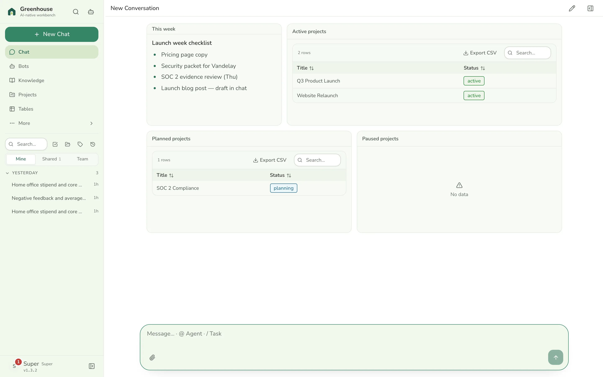
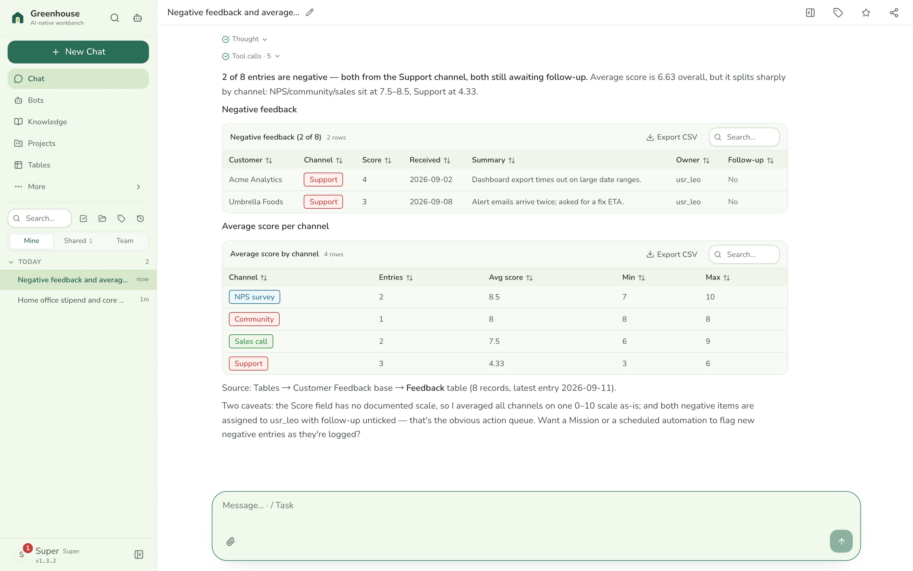
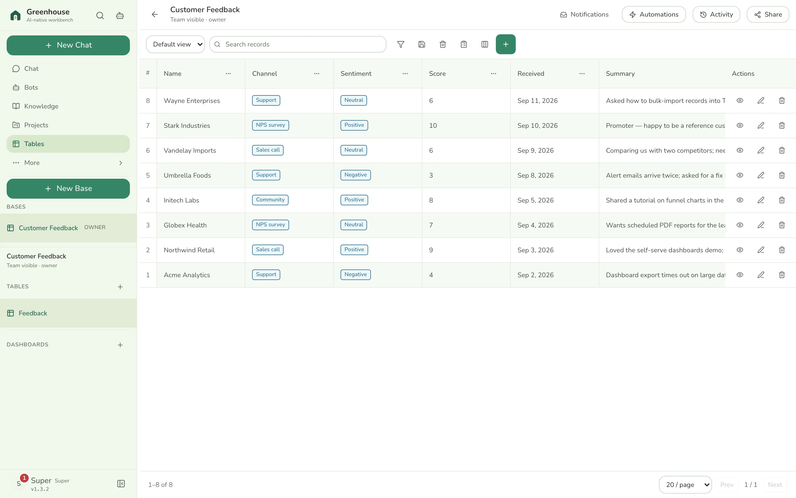
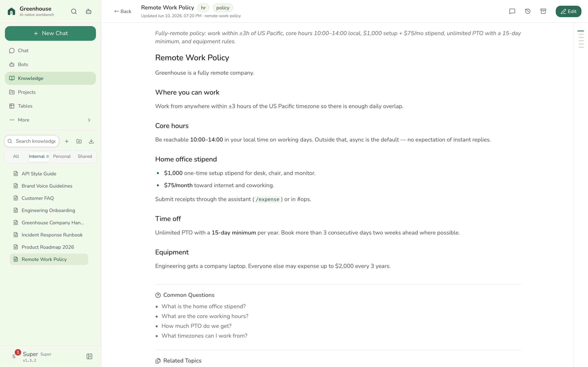
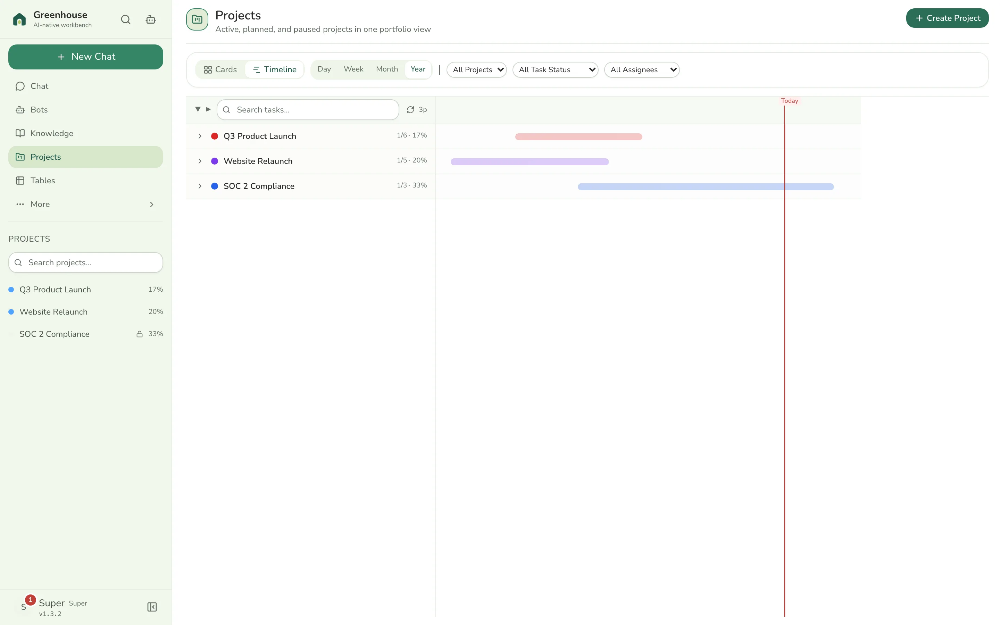
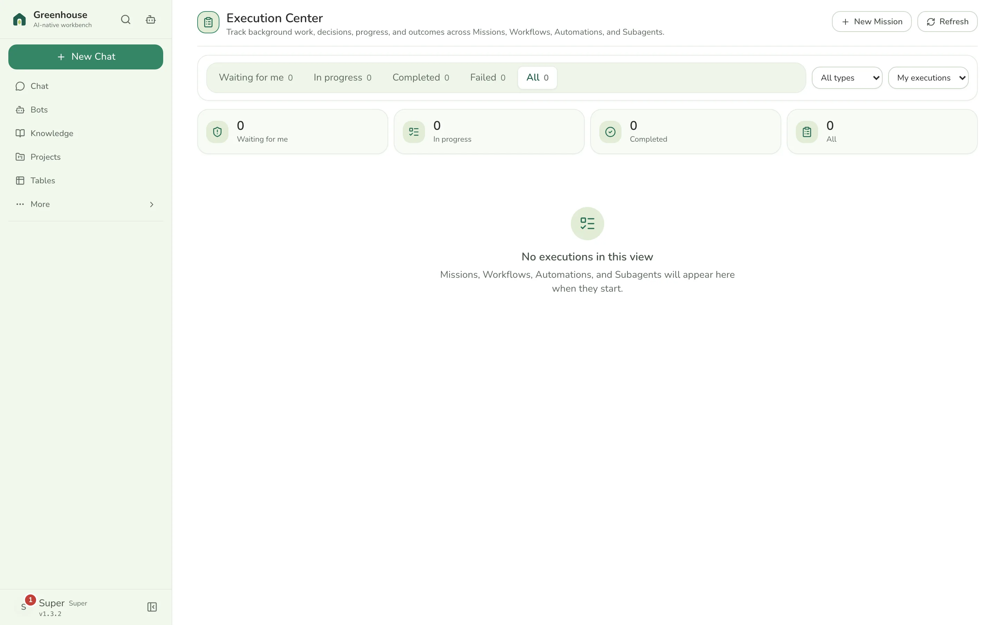
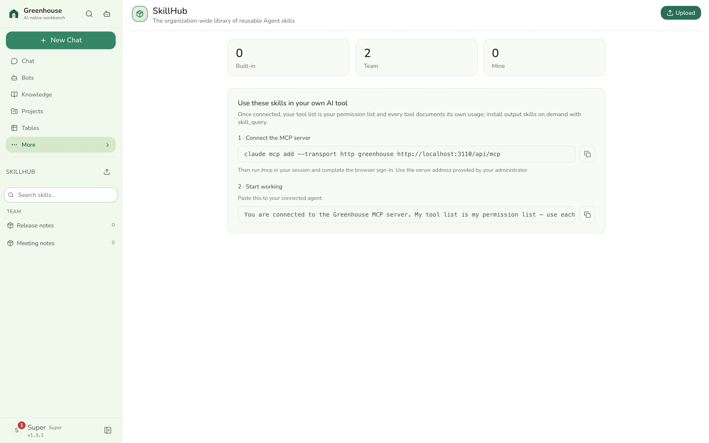
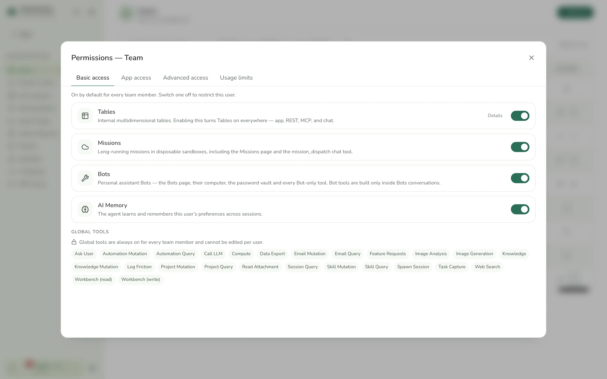
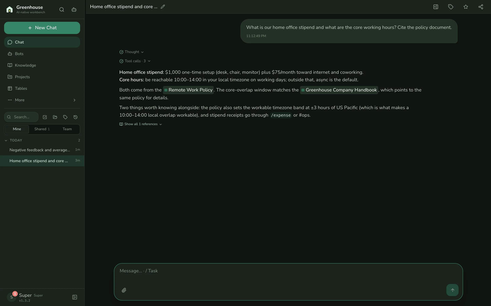
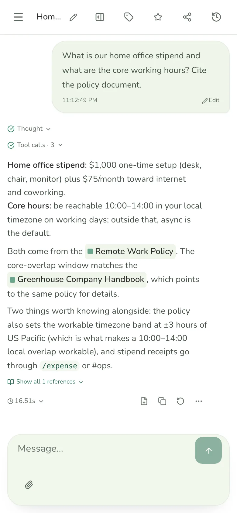

<p align="center">
  
</p>

Visual identity: [Haven logo, Nunito typography and shared design tokens](logos/README.md).

<p align="center">
  <a href="https://greenhouse.linjiejim.com"></a>
  <a href="./LICENSE"></a>
  <a href="https://github.com/linjiejim/greenhouse/releases/latest"></a>
  <a href="https://github.com/linjiejim/greenhouse/actions/workflows/ci.yml"></a>
  <a href="https://github.com/linjiejim/greenhouse/stargazers"></a>
</p>

**An open-source, AI-native enterprise agent workbench.** One command to self-host, members
log in with accounts (no app to install), and every capability is also callable by external
agents over [MCP](https://modelcontextprotocol.io/). Admins author tools in code that
auto-expose over chat, `/api/agent`, and `/api/mcp` — add a tool by writing one file.

Greenhouse is built around the idea that the agent *is* the product, not a feature bolted on
the side. Chat, the knowledge base, projects, tables, automations, missions and email all share
one tool layer and one permission model; the same tools your team uses in chat are the ones you
expose to Claude, Cursor, or any MCP client.

## A quick look

<p align="center">
  
</p>
<p align="center"><sub>Grounded answers: the agent searches the team knowledge base, cites the policy document, and the trace shows every tool call.</sub></p>

<table>
  <tr>
    <td width="50%" valign="top">
      
      <b>Home workbench</b> — live cards backed by the same tools; edit by drag-and-drop or ask the agent.
    </td>
    <td width="50%" valign="top">
      
      <b>Data in chat</b> — the agent queries a Tables base and answers with sortable, exportable tables.
    </td>
  </tr>
  <tr>
    <td width="50%" valign="top">
      
      <b>Tables</b> — typed fields, views, forms and record links; the agent plans schemas conversationally.
    </td>
    <td width="50%" valign="top">
      
      <b>Knowledge base</b> — team, personal and shared documents with backlinks and full-text search.
    </td>
  </tr>
  <tr>
    <td width="50%" valign="top">
      
      <b>Projects</b> — portfolio timeline, boards and task trees with members, comments and activity.
    </td>
    <td width="50%" valign="top">
      
      <b>Execution center</b> — automations, missions, workflows and sub-agents in one place, with an approval inbox.
    </td>
  </tr>
  <tr>
    <td width="50%" valign="top">
      
      <b>Skill Center</b> — versioned SKILL.md bundles with changelogs and security scanning.
    </td>
    <td width="50%" valign="top">
      
      <b>One permissions dialog</b> — roles, capabilities and feature flags, enforced once for HTTP, chat, the proxy and MCP.
    </td>
  </tr>
</table>

<p align="center">
  
  
</p>
<p align="center"><sub>Light / dark / system themes and a responsive layout; the <a href="apps/mobile">Expo app</a> covers chat (with the same rich replies as the web — data tables, charts (Swift Charts on iOS), stat tiles, record cards, step timelines, Mermaid diagrams, HTML previews, question forms and reply buttons — and a "connect your account" card when a connector needs your sign-in or key), your Bots (on iOS: Sprouty and your other Bots at the top of the drawer, one ongoing thread per Bot — other Bots join it when a hand-off helps — with live per-Bot replies, @-mentions, "needs you" cards that open into a sheet to decide, background tasks that report back; a Bot's profile gathers its instructions, memory, shared notes, schedules and separate chats in tabs; new Bots are made by asking Sprouty, from an example or by hand in Settings → My Bots; replies show just the answer, with reasoning, tool calls and sources one ⋯ → Show toggle away; a home-screen widget lines up your Bots with unread and "needs you" badges — one tap into a Bot's thread, or a new chat with Sprouty; notifications when a Bot needs you, a task finishes or a reply comes in after you left — content-free unless you turn previews on, one tap into the card or the conversation, on every station you are signed in to), Settings → Connectors for your own keys and sign-ins, knowledge and projects with a native UI on both platforms — on iOS system navigation, Liquid Glass, native sheets, menus and SwiftUI forms; on Android Material 3 (Jetpack Compose forms, menus and dialogs).</sub></p>

Every image above is produced by `node scripts/capture-screens.mjs` against a seeded dev stack — the
same script doubles as an end-to-end smoke tour (see [Development](#development)).

## Features

- **Chat** — streaming agent with tool-call traces, attachments of any file type (the agent
  reads text / CSV / JSON / xlsx / docx / PDF), per-turn model switching from a config catalog,
  a side pane for artifacts and records, session forking, background runs, sharing / grouping /
  tagging, and a global ⌘P search.
- **Knowledge Base** — team, personal and shared documents with a Tiptap editor, Markdown-first
  storage, folders plus a file cabinet, backlinks, comments and @-mentions, templates, version
  history, fine-grained sharing via groups, and segmented full-text search (CJK-aware).
- **Projects** — projects, tasks (board / gantt / tree views), members, comments, activity log.
- **Tables** — multidimensional bases: typed fields, views, forms, record links, dashboards,
  rule automations, and conversational schema planning (the agent drafts a base, you confirm).
- **Home workbench** — a personal dashboard of live cards backed by the same tools (recipes and
  templates), editable by drag-and-drop or by asking the agent.
- **Execution center** — one surface for every durable run: automations (cron), missions,
  workflows and sub-agents, with an approval inbox for steps that need a human.
- **Missions** *(optional)* — long-running tasks in disposable sandboxes (Docker + gVisor): the
  agent gets a real shell, files and a document toolchain, reports progress live and hands back
  artifacts.
- **Bots** — personal assistants every member gets out of the box. Every member starts with
  **Sprouty**, the main Bot pinned first: talk to it straight away, or let it bring in, brief and
  create other Bots (researcher, operator, writer, analyst, weekly reporter, note taker, project
  tracker or your own). A Bot has a name, a role
  and its own memory; several Bots can share one conversation (@-mention them, let them hand work
  to each other) and long conversations are summarised instead of truncated. With a computer
  enabled, each member's Bots share one cloud desktop (a browser with a taskbar, a shell, files
  and long-running jobs) the member can watch live, take over, or use directly through its
  terminal and file tabs; logins come from a write-only password vault that Bots fill in without
  ever seeing the values, and a site's "verify you are human" check is handed to the member with
  one click in the chat. Background tasks start from the brief you approve; reading private notes or history then
  disables all further browser actions. Their transcripts and execution traces stay owner-only, including
  against other admins. A new message can
  interrupt a Bot after its current step. The organisation configures one Docker host; computers
  start on demand, stop when idle (unless a job is still running) and queue when the host is full.
- **Workflows** — a multi-agent task-graph engine (database state machine, human gates,
  pause / retry per node) that the agent can plan from a conversation.
- **Memory** — per-user memories with titles, pinning and lifecycle, plus the friction signals
  the agent logs when tooling gets in its way.
- **Skill Center** — an org-wide library of agent skills (SKILL.md bundles) with immutable
  versions, changelogs, security scanning, and first-party packs shipped from `skillhub/`.
- **Email** *(optional)* — personal IMAP/SMTP mailboxes and a shared team mailbox; search,
  read, draft and send with a server-side draft confirmation.
- **Notifications** — an in-app notification center with durable delivery to email, WeCom and
  Feishu.
- **Integrations** *(optional)* — WeCom and Feishu account binding, direct-message push, Feishu
  sign-in, and a Feishu bot that runs the agent from a chat.
- **MCP server + agent tool-proxy** — OAuth 2.1 (PKCE for people, client credentials for
  machines) with scopes per resource group; the same tools over the structured `/api/agent`
  proxy.
- **Connectors (MCP client)** — install remote MCP servers from the official catalog
  (`connectors/`), the MCP Registry or by URL; members connect their own accounts (OAuth sign-in
  or their own key) and use the tools from chat and from their Bots through one `mcp_call`
  gateway tool — writes confirmed per call in chat, approved on a card in Bots.
- **LLM relay + usage budgets** — an OpenAI-compatible relay for internal users, plus monthly
  token and image budgets per user, organization and provider.
- **Platform kernel** — applications declare a manifest (modules, entities, fields, actions);
  roles, capabilities and record / field policies are enforced once for HTTP, chat tools, the
  proxy and MCP. One permissions dialog per user.
- **Workspace branding & runtime config** — rebrand from the web (name, logo, theme tokens) and
  manage runtime credentials (LLM / media / search) in Administration; values live in the
  database with env-var fallback and apply without a restart, from the login screen on.
- **Plant avatars** — every agent and Bot is a flat, geometric plant with a small face (16
  species, light and dark). Its pose, face and a small mark show what it is doing (thinking,
  working, done, needs you, error, asleep, saying hi), only the one that is speaking moves, and
  members pick their own plant and colour. Sprouty is the sprout, and the Bot templates are named
  after theirs: Dandy 蒲蒲 (dandelion), Cactus 仙仙, Fern 卷卷, Clover 叶叶, Sunny 葵葵 (sunflower),
  Lavender 薰薰 and Maple 枫枫.

Roles: **super > team**, plus per-user feature flags and platform policies that gate optional
modules. Auth is fail-closed — the server refuses to start without `TOKEN_SIGNING_KEY`, and
stored secrets need `PROVIDER_TOKEN_ENCRYPTION_KEY`.

## Architecture

A pnpm monorepo. The Hono API also serves the built React SPA, so production is a single
process / single container (plus optional images for Mission sandboxes and Bots computers).

```
greenhouse/
├── apps/
│   ├── api/                  # Hono backend — routes, agent runtime, platform kernel, auth,
│   │                         #   scheduler, runtime kernel, CLI; also serves the web SPA at `/`
│   ├── web/                  # React + Vite single-page app (hash router)
│   ├── agent-runner/         # Mission sandbox runner — built into the greenhouse/agent-runtime
│   │                         #   image; the API never imports it
│   ├── bot-computer/         # Bots computer image (desktop + Chromium + shell, zero published ports)
│   ├── browser/              # Chrome extension (MV3) — side-panel companion; connects to your
│   │                         #   instances via saved multi-server "stations"
│   └── mobile/               # Expo (React Native) app — chat, Bots (iOS), knowledge, projects, settings;
│                             #   native UI: iOS SwiftUI forms + Liquid Glass, Android Material 3
│                             #   (both via @expo/ui); isolated install (pnpm mobile:install,
│                             #   then pnpm mobile)
├── packages/
│   ├── agent-core/           # Agent kernel — streamText loop, OpenAI-compatible model factory
│   │                         #   + registry, provider quirks (no DB dependency)
│   ├── platform-kernel/      # Application manifests, actor context, authorization, registry
│   ├── types/                # Shared TypeScript types (feature flags, workspace settings, …)
│   ├── utils/                # Shared helpers (date, json, crypto, logger, semver, webhooks)
│   ├── db/                   # Database layer — Drizzle schema + domain services
│   ├── knowledge-editor/     # Tiptap schema + server-side Markdown ↔ Tiptap JSON
│   ├── crud/                 # Low-code CRUD framework (one schema → list / form / detail)
│   ├── ui/                   # Shared React UI kit (atoms, markdown, tool-call cards, plant avatars, tokens)
│   └── contract/             # Typed API contract — re-exports the API's AppType + hc
├── skillhub/                 # First-party skill packs (synced into the Skill Center on boot)
├── drizzle/                  # Migration files (the single source of truth for the schema)
├── scripts/                  # gen-secrets, backup-db, run-dev, e2e-ci, agent-runtime build
└── tests/                    # unit / db / e2e (API) / e2e-ui (Playwright)
```

**Stack:** [Hono](https://hono.dev/) API · React 19 + [Vite](https://vite.dev/) ·
PostgreSQL 16 + [Drizzle ORM](https://orm.drizzle.team/) · any OpenAI-compatible LLM ·
Node.js 22 (ESM, run via `tsx`).

Full package conventions live in [AGENTS.md](./AGENTS.md).

## Quick start (local development)

Prerequisites: Node.js ≥ 22, pnpm ≥ 11, Docker (for PostgreSQL).

```bash
# 1. Start just Postgres (bound to 127.0.0.1:5432)
docker compose up -d postgres

# 2. Install deps
pnpm install

# 3. Configure secrets + LLM
cp .env.example .env && ./scripts/gen-secrets.sh   # fills the required random secrets
#   then edit .env and set LLM_BASE_URL / LLM_API_KEY / LLM_MODEL

# 4. Apply the migration chain
pnpm drizzle-kit migrate

# 5. Create the first super-admin — or skip to step 6 to load the demo dataset instead
pnpm admin:create

# 6. (optional) Load the example dataset (it bundles demo admins) to explore with
#    realistic content. Fresh DB: no flag needed. To re-seed a populated DB, use
#    `pnpm seed --reset` (wipes first, asks to confirm).
pnpm seed

# 7. Run the dev servers (Vite web :3100 + API :3000, Vite proxies /api → api)
pnpm dev
```

Open http://localhost:3100. Backend changes require a restart (the API has no `--watch`);
frontend changes hot-reload.

> **One-command acceptance environment** — `pnpm run-dev up` starts Postgres + API + web
> together with unified logs under `.run-dev/`, avoids port clashes automatically, and gives
> each git worktree its own sandbox database (`greenhouse_wt_<dir>`); `pnpm run-dev stop`
> tears it down.

> **Custom ports** — if `:3100`/`:3000` clash with something, set `WEB_PORT` / `API_PORT` in
> `.env` (or as shell vars, which take precedence); the web dev proxy follows `API_PORT`.

> **Example dataset** — `pnpm seed` loads a small, de-identified fictional company (users,
> knowledge base, projects, chats, automations, a custom agent, sharing) so you can experience
> and validate every major feature. Every seeded user logs in with the password `greenhouse`
> (e.g. `maya@greenhouse.example`). See [`data/examples/README.md`](data/examples/README.md).
> On a non-empty database it refuses unless you pass `--reset` (wipe first) or `--keep`.

> **CLI console** — `pnpm cli <command>` is the dev/ops entry point for a self-hosted
> instance, mostly in-process (no running server needed): `users`, `tools`, `profiles`,
> `sessions`, `seed`, `db`, `doctor` (env + DB readiness), `knowledge` (reindex / import a
> folder of Markdown), `tables`, `platform` (scaffold an application), and `chat` (needs a
> running server). Run `pnpm cli --help` for the full guide.

## Deploy

Three ways, from least to most hands-on. All of them run the same image —
`ghcr.io/linjiejim/greenhouse`, built for `linux/amd64` and `linux/arm64` — and the
first-run steps below (`BOOTSTRAP_ADMIN_EMAIL`, `MIGRATE_ON_START`) need Greenhouse 1.4 or later.

### One-line install (a Linux server, or a Mac with Docker)

```bash
curl -fsSL https://greenhouse.linjiejim.com/install.sh | bash
```

The installer asks for the first administrator's email, an optional domain (HTTPS with
automatic certificates through Caddy — ports 80 and 443, DNS already pointing at the
server) and an optional model key, starts Postgres + the app with Docker Compose in
`~/greenhouse`, and prints the administrator's one-time activation link. Docker is the only
requirement; on Linux it offers to install it. Re-run it to upgrade. Unattended:
`… | bash -s -- --yes --email you@example.com --domain gh.example.com`; `--help` lists every
option. Where ghcr.io or Docker Hub cannot be reached, `--mirror <registry/namespace>` pulls
every image from a mirror registry (releases are copied there when the mirror is configured —
see [RELEASING.md](./RELEASING.md)).

### Railway

[Railway](https://railway.com) runs the published image next to a managed Postgres, with no
server to look after:

1. New project → **Database → PostgreSQL**; then **Docker Image** →
   `ghcr.io/linjiejim/greenhouse:latest`.
2. Variables on the image service:

   | Variable | Value |
   |---|---|
   | `DATABASE_URL` | `${{Postgres.DATABASE_URL}}` |
   | `TOKEN_SIGNING_KEY`, `PROVIDER_TOKEN_ENCRYPTION_KEY` | two different `openssl rand -hex 32` values |
   | `BOOTSTRAP_ADMIN_EMAIL` | your email |
   | `MIGRATE_ON_START` | `1` |
   | `API_PORT` | `3000` |
   | `PUBLIC_BASE_URL`, `APP_BASE_URL` | `https://${{RAILWAY_PUBLIC_DOMAIN}}` |
   | `TRUSTED_PROXY_HOPS` | `2` (Railway's router + edge — so rate limits see each visitor) |

3. Attach a volume at `/app/data` (uploads, Skill Center bundles), set the health-check
   path to `/health`, and generate a domain for port 3000.
4. Deploy, then open the activation link from the deploy logs
   (`[setup] Activate the first administrator …`).

Choose the model afterwards under **Administration → Runtime Config** (or set `LLM_BASE_URL`
/ `LLM_API_KEY` / `LLM_MODEL` as variables). For Bots computers, enter an [E2B](https://e2b.dev) key
in the same place (Bot computers), or set `BOTS_COMPUTER_E2B_API_KEY` — see Bots below.

### Docker Compose by hand

The bundled `docker-compose.yml` runs Postgres, a one-shot migration job, and the API
(which serves the SPA) as a single self-contained image.

```bash
cp .env.example .env && ./scripts/gen-secrets.sh   # fills required secrets
#   edit .env: set BOOTSTRAP_ADMIN_EMAIL, and LLM_BASE_URL / LLM_API_KEY / LLM_MODEL
docker compose up -d --build
docker compose logs api | grep 'Activate the first administrator'
```

The app is then at http://localhost:3000.

Prefer the published image over a source build? Use
[`docker-compose.ghcr.yml`](./docker-compose.ghcr.yml) instead — same stack, but it
pulls `ghcr.io/linjiejim/greenhouse` (no Node/pnpm toolchain needed):

```bash
docker compose -f docker-compose.ghcr.yml up -d    # tracks :latest; pin via GREENHOUSE_IMAGE in .env
```

### The first administrator

Set `BOOTSTRAP_ADMIN_EMAIL` and start the app: while nobody has activated an administrator
yet, every boot makes sure that account exists and logs a one-time activation link (the same
link member invites use — single use, valid 72 hours; a restart prints a fresh one). Open it,
choose a password, and you are signed in as the super admin. The variable does nothing once
an administrator exists, and it never promotes an existing account. Until then the login page
says where to look. With a shell in the container, `pnpm admin:create` works too.

Missions need one more piece on the host: Docker with the gVisor runtime, a dedicated bridge
network, and the sandbox image (`bash scripts/build-agent-runtime.sh`). They stay off until
`MISSION_ENABLED=1` and every preflight passes — see `.env.example`.

Bots work in any deployment. Their computers run in one of two places:

- **Hosted sandboxes (no server work)** — a provider key, entered under Administration → Runtime
  Config → Bot computers (or `BOTS_COMPUTER_E2B_API_KEY`): each member's computer is a sandbox
  (one microVM) at an E2B-protocol provider — [E2B](https://e2b.dev) abroad, PPIO in mainland
  China (`BOTS_COMPUTER_E2B_DOMAIN=cn-beijing-1.sandbox.ppio.com`; not yet verified end to end).
  Works from Railway, the installer or compose. On first boot the API builds the computer
  template at the provider (a few minutes); a computer then starts in seconds, sleeps
  (pauses — memory, files and logins kept, no cost while asleep) when idle and resumes where
  it left off. After a greenhouse upgrade changes the template, each computer moves its home
  into a new sandbox at its next start; if that move fails, the member keeps the old computer and
  the move is tried again a few hours later. Keep the API close to the provider's region: homes
  move through it.
- **This server's Docker** — the API must run **on the Docker host itself** (bare metal / PM2,
  not the compose image — computers are reached through `docker exec` and publish no ports),
  plus gVisor, a hardened bridge
  (`sudo BOTS_COMPUTER_NETWORK=bots bash scripts/cloud-agent-net.sh --profile bots`) and the
  computer image (`bash scripts/build-bot-computer.sh`; add organisation-wide Debian packages
  with `BOTS_COMPUTER_EXTRA_PACKAGES="…"`). The API only accepts an image of its own contract
  version, so rebuild the image whenever you upgrade.

On either kind, a Bot can hand you a **preview link** to a web app it runs on its computer (2 hours;
the page is sandboxed — no cookies or local storage — and only relative links stay inside it), and a
Bot that starts a long background process is woken to report when it ends.

**Backups** — set `BOTS_COMPUTER_BACKUP_DIR` (e.g. `data/bot-backups`) or `BOTS_COMPUTER_BACKUP_S3_*`
(any S3-compatible bucket) and every home is also kept, encrypted, in your own storage: as a computer
goes to sleep (at most daily; two kept per member) or when you click **Back up now**. When a member's
computer is gone — deleted at the provider, or you switched provider or driver — their next start
rebuilds it from the newest backup, and they are told what date it is from. Each backup is encrypted
in the API with its own key, sealed with `VAULT_ENCRYPTION_KEY`; the storage never sees a file.

Either way **Administration → Bot computers** lists every precheck with what fixes it, and the
live knobs (idle minutes, how many computers run at once) are in Runtime Config.

## Releases & stability

**Use a tagged release in production.** Two channels, and they are not equally
stable:

| You want… | Use | Stability |
|---|---|---|
| A version to run in production | A **tagged release** `vX.Y.Z` — [Releases](https://github.com/linjiejim/greenhouse/releases) · image `ghcr.io/linjiejim/greenhouse:X.Y.Z` (or `:X.Y`, `:latest`) | **Stable** — a cut we stand behind |
| The bleeding edge / to test `main` | `ghcr.io/linjiejim/greenhouse:edge` (or `:main-<sha>`) | **Unstable** — CI builds off `main`; may break between releases |

`:latest` always points at the newest **stable** release — never at `main`.
Every release is stamped: `GET /health` returns the `version` + commit `revision`
the running build was cut from, so a bug report can be matched to exact code.

The **browser extension** is attached to each Release as
`greenhouse-bridge-vX.Y.Z.zip` (unzip → Chrome → "Load unpacked", or submit to the
Web Store). The **mobile app** ships on its own cadence via EAS: JS-only changes
roll out as over-the-air updates; native changes auto-build and upload to
TestFlight. Maintainer runbook: **[RELEASING.md](./RELEASING.md)**.

The **desktop app** (a Tauri shell for macOS on Apple Silicon and Windows x64) is
attached to each Release as well; installed copies update themselves from the project
site. The macOS build is ad-hoc signed — no Developer ID — so a `.dmg` that came through
a browser carries the quarantine flag and Gatekeeper reports it as *damaged* instead of
warning. Install from the terminal instead: `curl` and `tar` set no quarantine flag, and
the app opens like any other.

```bash
curl -fsSL https://github.com/linjiejim/greenhouse/releases/latest/download/Greenhouse-macos-aarch64.app.tar.gz | tar xz -C /Applications
```

(Already have the `.dmg`? `xattr -dr com.apple.quarantine /Applications/Greenhouse.app` gets
you to the same place.) Windows:
[`Greenhouse-windows-x86_64-setup.exe`](https://github.com/linjiejim/greenhouse/releases/latest/download/Greenhouse-windows-x86_64-setup.exe)
— unsigned, so SmartScreen asks once (*More info → Run anyway*). Later versions arrive
through the built-in updater, signature-checked, without any prompt.

### Upgrading

Database migrations ship inside the image and are applied by a one-shot `migrate`
service **before** the API starts — an upgraded deployment never runs new code
against an old schema, and already-applied migrations are skipped. Optional but
wise before a big jump: `./scripts/backup-db.sh`.

```bash
# Docker, published image (docker-compose.ghcr.yml):
docker compose -f docker-compose.ghcr.yml pull
docker compose -f docker-compose.ghcr.yml up -d

# Docker, built from source (a fork / local checkout):
git pull && docker compose up -d --build

# Bare-metal source checkout:
git pull && pnpm install && pnpm drizzle-kit migrate   # then restart the API
```

> **Upgrading from 0.6.x** — this line removes the public/guest surface (`/api/v1`, the
> `default` profile, external accounts) and the database-managed LLM gateway upstreams in
> favour of the model catalog below. The migration retires external accounts, disables
> legacy agent-to-agent API keys, and drops email accounts (they must be re-added under
> Settings → Email with explicit IMAP/SMTP settings). Existing custom agents become
> immutable draft v1 and stay unshared until a super publishes them. Knowledge documents are
> re-tokenized for search on the first boot.
>
> **Upgrading from 1.3.x** — custom Agents and Bots merged into one private identity: every
> custom Agent becomes a Bot of its owner (same versions; `custom:<id>@<v>` references keep
> resolving), sharing / review / clone are gone (other members' pinned references to a shared
> Agent stop resolving), the Agents page moved to Settings → My Bots, and the knowledge
> full-text index is created on migration.

## Configuration

Everything is environment-driven; see [.env.example](./.env.example) for the full list.

**Required** (the server fails to start without the auth/encryption keys):

| Variable | Purpose |
|---|---|
| `DATABASE_URL` | PostgreSQL connection string |
| `TOKEN_SIGNING_KEY` | Signing key for auth tokens (`openssl rand -hex 32`) |
| `PROVIDER_TOKEN_ENCRYPTION_KEY` | AES-256-GCM key for stored secrets — email passwords, integration tokens, workspace-setting secrets (`openssl rand -hex 32`) |
| `VAULT_ENCRYPTION_KEY` | Optional: the Bots' password vault's own key (falls back to `PROVIDER_TOKEN_ENCRYPTION_KEY`). Rotate it with `VAULT_ENCRYPTION_KEY_PREVIOUS` + `pnpm cli vault rekey` — see `.env.example` |
| `LLM_BASE_URL` / `LLM_API_KEY` / `LLM_MODEL` | Any OpenAI-compatible endpoint; the `flash` catalog entry resolves to `LLM_MODEL` (add a stronger `pro` with `LLM_MODEL_PRO`). The server starts without them — chat needs them, and they can be set later in Runtime Config |

**First run and hosting**: `BOOTSTRAP_ADMIN_EMAIL` (the first administrator's activation link —
see [The first administrator](#the-first-administrator)), `MIGRATE_ON_START=1` (apply database
migrations at startup, for hosts without a separate migration step), and — behind a reverse
proxy — `TRUSTED_PROXY_IPS` (proxies with fixed addresses) or `TRUSTED_PROXY_HOPS` (how many
proxies stand in front, for platforms whose proxy addresses rotate, e.g. `2` on Railway), so rate
limits and the audit log see each visitor's own address.

**Model catalog** — `apps/api/src/config/models.yaml` is the single definition of every model
a deployment can use: the built-in `flash` / `pro` entries follow `LLM_*`, and the native
DeepSeek V4.1 Flash entry (`deepseek-flash`) appears in the chat picker as soon as
`DEEPSEEK_API_KEY` is set. Add a provider entry to offer another model; secrets never live in
the file. The default model is treated as multimodal: images attached in Chat go straight into
its payload. Set `LLM_VISION=false` when `LLM_MODEL` is text-only, and images go through
`analyze_image` instead.

Optional: media (vision `analyze_image` + `generate_image` through `MEDIA_*`, falling back to
the LLM endpoint; `IMAGE_BASE_URL` + `IMAGE_API_KEY` move generation alone to an image
provider), external web search, email mailboxes, WeCom / Feishu, missions, Bots computers
(`BOTS_COMPUTER_*`), usage budgets, and object storage. Uploads default to local disk (`data/uploads`), Skill Center
bundles to `data/skills` — set `SKILLS_S3_*` to keep bundles in S3-compatible storage.

**Mobile push**: the iOS app's notifications (a Bot needs you, a background or scheduled task
finished, a Bot replied after you left) are sent through the Expo Push Service at `exp.host`.
The server stores only each phone's Expo push token (no Apple key — the official app's
credentials live with Expo), and by default a notification says only who and what kind of thing
("Sprouty · Needs your approval"); members can turn on previews per phone in the app's Settings →
Notifications. It is on by default and inert until a member allows notifications on a phone; set
`MOBILE_PUSH_ENABLED=false` to keep every request off `exp.host` (the app then hides its push
settings). The server must be able to reach `https://exp.host` (honouring `HTTPS_PROXY`); the
Settings page's "Send a test" checks that from the phone.

**Admin-configurable at runtime**: the LLM / media / search credentials and the product name
can also be set in **Administration → Runtime Config** (and branding in **Branding Studio**) —
values saved there are stored in the database (secrets encrypted with
`PROVIDER_TOKEN_ENCRYPTION_KEY`), win over the env vars, and apply without a restart.

**Structure lives in code**: [`greenhouse.config.ts`](./greenhouse.config.ts) (typed, validated
at boot) declares which extensions are switched on, where content packs live (skill packs,
agent profiles, a seed dataset) and how the browser extension / mobile app treat server
stations. `GREENHOUSE_EXTENSIONS=crm,example` overrides the extension list per deployment.

## MCP & agent access

Every capability is reachable three ways from the same tool layer:

- **Chat** — tools the user is entitled to are passed to the model in `/api/chat`.
- **`/api/agent`** — structured tool proxy for programmatic clients: `GET /runtime-manifest`
  lists the caller's available tools (with input schemas), `POST /tools/:id/call` invokes one.
  Read tools run freely; write tools are deny-by-default and require `confirm: true`.
- **`/api/mcp`** — the same proxy wrapped in the standard MCP protocol (Streamable HTTP), so
  any MCP client (Claude, Cursor, …) can connect. Auth is **OAuth 2.1**: people authorize with
  Authorization Code + PKCE from their own account; automation uses machine clients
  (client credentials) that a super binds to a least-privilege internal user under
  Administration → MCP Access. Scopes combine an action (`mcp:read` / `mcp:write`) with
  resource groups (`mcp:knowledge`, `mcp:projects`, `mcp:tables`, …).

### Connectors (Greenhouse as an MCP client)

Greenhouse is an MCP **client** too. A super installs remote MCP servers ("connectors") under
Administration → MCP Servers — from the **official catalog** (`connectors/*.json`, vetted entries
in the MCP Registry's own `server.json` format; see [connectors/README.md](connectors/README.md) to
contribute one), by searching the **official MCP Registry**, or by URL (a *Detect* button tells
whether the address wants no sign-in, a key, or OAuth). Members granted the **External MCP tools**
(`mcp_call`) tool reach them from chat and from their Bots through that one gateway tool.

Each connector authenticates one of four ways:

| Sign-in | Whose credential | Example |
|---|---|---|
| None | nobody's — a public server | DeepWiki, Microsoft Learn, Context7 |
| Shared credential | the admin's one key, for everyone | an internal server behind a token |
| Each member's own key | the member pastes it (header or query parameter) | GitHub (PAT), Amap |
| Each member signs in (OAuth) | the member's own account, MCP authorization spec | Linear, Notion, Sentry, Atlassian |

Members connect under Settings → **Connectors** (on the web and in the mobile app); a chat that
needs a connector they have not connected shows a **Connect** card. OAuth follows the MCP authorization spec (protected-resource
discovery, PKCE, resource indicators) and needs no setup at the provider when it supports dynamic
client registration or client-id metadata documents — the instance registers itself, with the
callback `PUBLIC_BASE_URL/api/connectors/oauth/callback` (for providers without either, such as
GitHub, enter a client id you registered there). Keys and tokens are stored encrypted per member
and never returned; a member's connection is theirs alone.

Results are wrapped as untrusted external content. A tool the server does not mark read-only (and
the catalog or an admin did not vouch for) needs the user's explicit confirmation per call in chat;
in a Bots conversation it asks on an approval card, and a Bot's own connector list narrows what it
may reach. Connectors are not offered to scheduled tasks, background tasks, Feishu or the browser
extension, and are never re-exported through `/api/agent` or `/api/mcp`.

For both proxy surfaces the effective tool set is `resolveEffectiveTools(user, profile)`
intersected with the proxy allowlist — a tool only appears if it declares the relevant
`surface` in its metadata (see below). The proxy can only *narrow* a user's permissions,
never widen them.

## Adding a tool

A tool's metadata and implementation live in one file, declared with `defineTool`, and the
tool is registered with one line in `CORE_TOOL_MODULES` (`apps/api/src/tools/registry.ts`).
A tool that needs nothing about the caller is **static**: it is built once, and `create`
receives the shared database handle.

```ts
// apps/api/src/tools/my-tool.ts
const meta: ToolMeta = {
  id: 'my_tool',
  name: 'My Tool',
  brief: 'one-line summary for catalogs and the permissions UI (never sent to the model)',
  description: 'full usage instructions — this is what the model reads, on every step',
  category: 'team', // 'core' | 'team' | 'admin'
  is_global: true, // on for every internal user, no assignment needed
  icon: 'Wrench', // Lucide icon name
  sort_order: 50,
  surface: {
    proxy: 'read', // 'read' (no confirm) | 'write' (confirm-gated) | 'none'
    mcp: 'knowledge', // MCP resource group (needs a proxy tier); omit to keep it off /api/mcp
  },
};

export function createMyTool(db: DatabaseProvider) {
  return tool({ description: meta.description /* , inputSchema, execute: uses db */ });
}

export const myTool = defineTool({ meta, kind: 'static', create: (db) => createMyTool(db) });
```

A tool that must know who is calling is **lazy**: it is built per request, so every read and
write can be scoped to that user. A core lazy tool declares no `create`; its file exports the
factory, and the factory gets one construction case in `buildLazyServerTools`
(`apps/api/src/agent-runtime/tool-resolution.ts`). Tools bound to a conversation go inside that
function's `if (sessionId)` block, so they never appear on the stateless `/api/agent` and
`/api/mcp` surfaces. Extension tools skip this step: they set `createLazy(ctx)` and are built
through a generic path (see [Extensions](#extensions)).

```ts
// apps/api/src/tools/my-user-tool.ts
const meta: ToolMeta = { id: 'my_user_tool' /* , …the same fields as above */ };

export function createMyUserTool(db: DatabaseProvider, ctx: { userId: string }) {
  return tool({ description: meta.description /* , inputSchema, execute: filters by ctx.userId */ });
}

export const myUserTool = defineTool({ meta, kind: 'lazy' });

// apps/api/src/agent-runtime/tool-resolution.ts, inside buildLazyServerTools
if (effectiveTools.includes('my_user_tool')) {
  tools.my_user_tool = createMyUserTool(db, { userId });
}
```

There is no per-tool access guard to declare. Who may call a tool is resolved before anything
is built: `super` gets every tool; a `team` member gets the `is_global` tools, the tools owned
by each feature flag they have, and any tools assigned to them individually. A Bot's tool
filter can only narrow that set, and each surface narrows it again (the proxy allowlists and OAuth scopes,
the unattended denylist for scheduled runs). Ownership of the data itself is checked inside the
tool, against the `userId` its factory received.

The registry derives every exposure set from the catalog, with no hand-maintained id lists: the
read and write proxy allowlists, the MCP set per resource group, the Home-workbench and builtin
sets, and the lazy id list all come from each tool's `meta.surface` / `builtin` / `kind`. Guard
tests pin the result: `tools/__tests__/surface-derivation.test.ts` fixes the exact core members
of the proxy, MCP, workbench and lazy sets (an intentional exposure change edits the tool and
the test together), and `description-budget.test.ts` caps the combined length of tool
descriptions, since every one is sent to the model on every step.

The other `meta` fields: `surface.workbench` (safe to re-run as a Home card),
`surface.unattendedReplaySafe` (may run with nobody present and be retried), `builtin` (part of
every Agent, even a custom one that did not list it), `runtime_risk` (the risk class recorded
on each call when the surface does not imply it) and `presentation` (`'artifact'` marks a
result that renders as an inline card rather than a trace row). The header of
`apps/api/src/tools/define.ts` is the field-by-field reference.

Optional modules are gated by per-user feature flags (`packages/types/src/features.ts`) and
by **feature points** (`apps/api/src/platform/feature-points.ts`), which map a flag or an
application to the tools it owns so one switch controls the app, REST, MCP and chat at once.
A non-global tool that no flag or application owns lands in the *Advanced tools* bucket and is
granted per user.

## Adding an application

Larger modules are **platform applications**: a JSON-serializable manifest (modules, entities,
fields, actions, navigation) plus a registration that binds handlers. The kernel enforces
capabilities and record / field policies once, for every transport. Scaffold a fail-closed
starting point with:

```bash
pnpm cli platform create-app my-app --title "My App"
```

See [EXTENDING.md](./EXTENDING.md) for the full map of extension points.

## Extensions

Private or optional modules do not need to touch core at all. An **extension** is two folders
and two list entries:

```
apps/api/src/extensions/<id>/    tools, routes, tables + migrations, services, jobs, commands, flags, settings
apps/web/src/extensions/<id>/    pages, navigation, settings modules, translations, chat cards
apps/api/src/extensions/index.ts one import line   ·   apps/web/src/extensions/index.ts one import line
```

Each half exports one object — `defineExtension({...})` / `defineWebExtension({...})` — whose
fields map 1:1 onto the core registries: the tool catalog (and with it `/api/agent` and
`/api/mcp`), route mounting, platform applications, feature flags and points (one switch in
the permissions dialog), Runtime Config settings, public paths, the scheduler, the CLI, the
database services, a dedicated **migration lane** (`extension_migrations`, applied at boot under
an advisory lock), record kinds with deeplinks and chat peeks, lanes in global search, whole-dataset
sources for `export_data`, its own scope in the shared file Drive, MCP consent groups, Home
workbench cards, the hash router (including a page's own sub-modules), the sidebar, i18n, tool
cards and the agent panel. Which extensions are *active* is decided per deployment by
`greenhouse.config.ts` or `GREENHOUSE_EXTENSIONS`; an inactive extension contributes nothing —
no tools, no routes, no migrations.

The shipped `example` extension (off by default; `GREENHOUSE_EXTENSIONS=example` to try it) is a
complete reference — per-user notes with their own table, tool, API, page, "More" entry,
Settings module, Runtime Config section, job and CLI command. Forks keep their modules under
`apps/*/src/extensions/`, content under `packs/`, and run `scripts/check-extension-overlay.mjs`
in CI so a commit outside the seam fails instead of drifting from upstream. The full contract
and the fork workflow are in [EXTENDING.md](./EXTENDING.md#extensions).

## Development

```bash
pnpm dev            # Vite web (:3100) + API (:3000), proxied
pnpm test           # every layer: unit + db (transaction-isolated) + db-commit
pnpm test:unit      # fast feedback: unit / contract tests only
pnpm test:db        # database integration tests (needs a migrated greenhouse_test)
pnpm test:e2e:ci    # live-server API e2e suite, self-contained (boots the API, dead LLM)
pnpm test:e2e:ui    # Playwright browser suite (tests/e2e-ui; auto-starts pnpm dev)
pnpm typecheck      # tsc --noEmit
pnpm lint           # eslint + prettier --check
pnpm lint:fix       # auto-fix
```

### Screenshot tour (visual smoke test)

```bash
pnpm dev                         # or pnpm run-dev up — with `pnpm seed` loaded
node scripts/capture-screens.mjs # logs in as the seeded super, seeds a demo base, walks every surface
```

The tour writes `docs/assets/screens/*.webp` (plus a chat `gif`/`mp4`, needs `ffmpeg` and `cwebp`)
and exits non-zero on any console error or failed `/api` request, so it doubles as a real-browser
smoke test. Re-run it after visible UI changes so the README and landing page stay truthful.

### Agent evaluation

Two layers. **Administration → Evaluation** (`pnpm cli eval`) replays single-question regression
cases against the live agent and an LLM judge scores each answer against its expected facts; the
starter set (`pnpm cli eval seed`) asks about the example dataset's knowledge base. The
**[Agent scenario bank](docs/evals/README.md)** — 43 end-to-end tasks across Chat, Bots and mobile,
scored by a reviewer on process, deliverable and safety — covers what one turn can't (approval
cards, permissions, Bots computers, attachments). It is run by hand today; a scenario runner is
the planned follow-up.

A husky + lint-staged pre-commit hook runs `eslint --fix` + `prettier --write` on staged
files. CI (`.github/workflows/ci.yml`) runs lint → typecheck → test → e2e → secret-scan on
`main` and every PR.

### Database migrations

Migration files (`drizzle-kit generate` → `migrate`) are the single source of truth for the
schema. Edit `packages/db/src/schema/*.ts`, run `pnpm drizzle-kit generate`, review the
generated SQL, and commit it. **On persistent / shared databases use `migrate` only — never
`push`** (`push` is for throwaway local scratch DBs). See
[packages/db/src/AGENTS.md](./packages/db/src/AGENTS.md).

### Backups

```bash
./scripts/backup-db.sh                                   # dump to data/db/backups/
PG_CONTAINER=greenhouse-postgres-1 ./scripts/backup-db.sh /srv/backups   # docker compose stack
```

Every dump is **verified** before it counts (gzip integrity, a size floor, pg_dump's own
completion marker) — a failed dump leaves no file behind, so a cron log or mail shows the
failure instead of an empty archive that looks like a way back. Retention keeps the newest
seven plus eight Sunday dumps and only ever touches files the script named itself
(`<prefix>_YYYYmmdd_HHMMSS.sql.gz`); hand-made archives next to them are left alone.
`PG_CONTAINER` / `PG_USER` / `PG_DB` / `BACKUP_PREFIX` / `KEEP_DAILY` / `KEEP_WEEKLY` select
the target and the policy.

## Contributing

Contributions are welcome. See [CONTRIBUTING.md](./CONTRIBUTING.md) for setup, the
quality gates, and conventions, and please follow the
[Code of Conduct](./CODE_OF_CONDUCT.md). Found a security issue? Don't open a public
issue — see [SECURITY.md](./SECURITY.md).

## License

[MIT](./LICENSE) — © Greenhouse contributors.
