# 数据库结构（PostgreSQL）

> 事实源：`packages/db/src/schema/*.ts`。本文只描述当前 schema，不保留已删除表的历史定义。
>
> 当前共 **137 张表**。字段类型、默认值、索引的最终解释以 Drizzle schema 与最新 migration snapshot 为准。

## 设计约定

- 数据访问统一通过 `getDb()` 返回的域 service；业务代码不直接写 SQL。
- 内部有效用户角色只有 `team` 与 `super`。数据库仍允许读取历史 `external` 角色值以完成迁移兼容，但这类账号必须为 `disabled`，中央鉴权必须拒绝其 token。
- Agent Profile 的持久化默认值是 `team`：`sessions.profile_id`、`eval_runs.profile_id`、`scheduled_tasks.profile_id` 与 `custom_profiles.base_profile_id`。
- 域内强所有权使用 FK，并明确 `CASCADE` / `SET NULL`；审计、统计、跨域主体引用通常保持逻辑关联，避免主体删除时丢失历史。
- `tags`、`meta`、`config`、`scopes` 等 JSON 数据目前以 `TEXT NOT NULL` 保存，默认值为 `[]` 或 `{}`。
- `table_records.values/computed_values` 是动态字段检索的真实数据库路径查询需求，按列例外使用 `JSONB NOT NULL DEFAULT '{}'`；Tables 的 field/view/widget 配置使用 JSON 文本，Form/Automation 配置使用类型化 JSONB。
- 所有时间点使用 `TIMESTAMPTZ`；仅业务日期（如 `due_date`、`deal_date`）使用 `TEXT` 保存 `YYYY-MM-DD`。
- `messages.seq` 由写入事务锁定对应 `sessions` 行后分配，并以 UK `(session_id, seq)` 兜底；游标分页因此不会因跨端并发写入出现重复序号或漏读。普通 assistant 写入还会在同一锁内比较生成前的 tail `id + content`（流式聊天与 Scheduler/workflow/subagent headless runner 一致）；用户消息编辑与后续 turn 截断同样是单事务，避免持久化基于旧 prompt 的回复。
- Runtime Kernel 的 Run/Step/ToolCall/Artifact/Interrupt/Event/Outbox 保存完整参数与结果，生产 Service 不提供删除方法，也没有 TTL、截断或定时清理；显式删除 Runtime 根 Run（仅测试 fixture/未来明确的用户删除语义）才按域内 FK 级联。
- Usage Budget 的账户、预留和账本都永久保留，不设自动过期删除；TTL 只结束“占用中”状态，结果未知的 stale 预留按估算量记入 spent，只有明确未开始 provider I/O 的调用才可 release。

## 表目录

### 身份、用户配置与团队

| 表 | 主键 / 唯一约束 | 关键字段与用途 |
|---|---|---|
| `users` | PK `id`；UK `email` | 内部账号；`role=team/super` 为有效角色，`status=invited/active/reset_required/disabled`；只有 active 可认证，`auth_version` 在密码设置/重置时原子递增以撤销既有凭证；新账号月度 token 限额默认 100M，另含兼容消息限额、locale、备注与登录时间 |
| `user_tools` | 复合 PK `(user_id, tool_id)` | 每用户工具授权；`user_id` FK 到 users |
| `refresh_tokens` | PK `id`；索引 `token_hash`、`user_id` | 刷新令牌只存 hash、有效期与签发时 `auth_version`；单次消费且必须匹配用户当前版本，用户删除时级联 |
| `account_password_links` | PK `id`；UK `token_hash`；部分 UK `user_id WHERE consumed_at/revoked_at IS NULL` | super 签发的邀请/重置设密凭证；只存 32-byte 随机 token 的 SHA-256 hash、签发代数、过期/消费/撤销时间与邮件投递结果。邀请 72h、重置 30m；目标用户删除时级联 |
| `user_features` | PK `id`；UK `(user_id, feature)` | 用户级 feature flag；`enabled`、JSON `config`、授权人 |
| `feishu_conversations` | PK `id`；UK `feishu_key` | 飞书对话 ↔ Greenhouse 会话映射（迁移 0066）。`feishu_key` = `thread_id ?? root_id ?? message_id` 的回退结果：话题群命中 thread_id（每个话题一个会话）、普通回复链命中 root_id、首次发言用自己的 message_id。**实测 `root_id` 在整条回复链里恒定**，所以用户回复链上任意一条旧消息都续同一个会话。唯一键同时是并发仲裁者——同一串对话的两条消息同时到达时，`DO NOTHING` 让先到的赢，绝不会建出两个会话 |
| `feishu_message_receipts` | PK `message_id` | 已处理的飞书消息 id（迁移 0066）。飞书会重投事件，而处理一条消息 = 跑一轮 agent = 花钱且会回消息；**先写回执再干活**，写冲突即丢弃。回执只为去重，保留 7 天足够覆盖任何重投窗口 |
| `user_provider_tokens` | PK `id`；UK `(user_id, provider, workspace_id)`，NULLS NOT DISTINCT | 通用外部 provider 绑定；access/refresh/credential 为加密文本，含 scope、过期时间与 metadata。**`access_token` 自 0056 起可空**——企微这类绑定存的是**身份**而非凭证（应用 token 是 corp 全局、进程内缓存），塞一个空串会让该列自己的契约变成假的；`provider_user_id` 即企微 UserId（`provider='wecom'`）或飞书 open_id（`provider='feishu'`），是个人消息推送的收件人来源；飞书绑定同时是扫码登录的查表键 |
| `custom_profiles` | PK `id`；UK `(user_id, slug)` | 自定义 Agent 稳定资产身份；owner/current/published version 指针与 draft/review/pilot/verified/rejected/suspended/deprecated/archived 生命周期。共享只由 pilot/verified 派生；backup owner FK SET NULL，reviewer 为保留历史的逻辑引用 |
| `custom_profile_versions` | PK `id`；UK `(profile_id, version)` | 不可变可执行 manifest；模型、tools、prompt、外观与 purpose/audience/risk/budget/eval refs/review due 一起版本化，含 change log、SHA-256 manifest hash 与创建人；生产 service 无 update/delete |
| `user_memories` | PK `id` | 用户长期记忆；`title`（注入 prompt 的召回索引行）+ `content` + 类别、状态机（active/dormant/archived/superseded）、pinned、来源、`superseded_by` 自引用、`last_used_at` |
| `tool_frictions` | PK `id`, UNIQUE `fingerprint` | Agent 踩坑信号（团队级，永不注入 prompt）；工具/类型/摘要/证据、`occurrence_count` 聚合计数、样本会话、复盘状态与解决备注 |
| `user_prompts` | PK `id`；UK `artifact_action_id` | **Tasks**（可复用任务，用户面已改叫 Tasks，表名保留）；`description` 一句话用途说明（选择器里展示）、`variables` JSON 存 `{{占位符}}` 定义、`expected_tools` JSON 存该流程实际用过的工具（**仅展示，不做权限判定**）、`source_session_id` 逻辑指向固化来源会话（无 FK，任务比会话活得久）、`created_via` 区分手写与会话固化。聊天固化时 `artifact_action_id` 是 exactly-once 恢复键；无变量无工具的行 = 原来的快捷 Prompt，行为逐字段不变 |
| `user_groups` | PK `id` | 用户创建的小组；`created_by` 为逻辑用户引用 |
| `group_members` | PK `id`；UK `(group_id, user_id)` | 小组成员；同时 FK 到 user_groups 与 users |

### 会话、Agent 运行时与个人整理

| 表 | 主键 / 唯一约束 | 关键字段与用途 |
|---|---|---|
| `sessions` | PK `id` | 会话；`profile_id` 默认 `team`，记录 user/app/channel、父会话谱系、评分、反馈与 JSON metadata |
| `messages` | PK `id`；UK `(session_id, seq)`；索引 `session_id` | 会话消息；含 role/content、引用、pipeline、reasoning、图片、置信度、token 与耗时；`seq` 为会话内唯一顺序；普通回复以 tail revision CAS 追加，编辑与截断为原子事务；重新生成在成功后以同一 `seq` 原子替换末尾 assistant，失败保留旧回复。`model` 记产出该轮的 registry 模型 id（`flash`/`pro`/…，模型改为每轮可选后新增）——user 轮、服务端写的终态消息与历史消息均为 null |
| `chat_files` | PK `id`；UK `storage_key`；索引 session/creator | Chat 会话的私有文件 handle（两个方向）；字节在对象存储，记录 session、文件名/MIME/size、服务端 storage key 与创建人。`source`：`agent`=工具产物（如 `export_data`，存量行的默认值）/ `user`=用户上传的附件。**图片不进这张表**——`` 带不了 Bearer，图片走 `/api/upload` 的扁平 id + 公开读 |
| `chat_artifact_receipts` | PK `id`；索引 session/user | 聊天动作卡的持久回执；稳定 action id 原子 claim，绑定 session/user/kind/request hash，保存 processing/succeeded/failed 与原始结果。用于 Schema Plan 与 Task Capture 的刷新恢复和 exactly-once 执行，不替代业务表 |
| `session_shares` | PK `id`；UK `(session_id, shared_with)`；FK `session_id` CASCADE | 会话共享；目标为 user id 或 `__team__`；已读状态独立存于 `session_share_reads` |
| `session_share_reads` | PK `id`；UK `(session_id, user_id)`；FK `session_id` CASCADE | 团队共享的逐用户已读状态 |
| `session_tags` | PK `id`；UK `(user_id, name)` | 用户私有会话标签 |
| `session_tag_links` | PK `id`；UK `(session_id, tag_id)` | 会话与标签关联；标签删除时级联 |
| `session_groups` | PK `id`；UK `(user_id, name)` | 会话文件夹；`kind=custom/pinned` |
| `session_group_members` | PK `id`；UK `(user_id, group_id, session_id)`；部分 UK `(user_id, session_id) WHERE kind='custom'` | 每用户的会话归档；同一会话最多进入一个 custom 文件夹，但可同时 pinned |
| `llm_calls` | PK `id`；索引 `session_id` | `call_llm` 子调用审计；保存输入、输出、模型、状态、token 与耗时 |
| `llm_usage` | PK `id`；索引 profile/caller/user/created_at/budget key | LLM 用量统计；按 profile、caller、session、user、model 记录 token 与耗时；`budget_idempotency_key` 关联统一预算预留，NULL 表示迁移前或尚未接入预算的 legacy 调用 |
| `scheduled_tasks` | PK `id` | 用户定时 Agent 任务；profile 默认 `team`，保存 cron、时区、执行状态与计数；`notify_webhook`（可选企微/飞书**群**机器人地址，host 白名单二选一、按 host 分派 payload 格式）、`notify_email`（布尔，发到 owner 账号邮箱）、`notify_wecom`（布尔，以企微应用消息发给 owner 本人，收件人取自其 `user_provider_tokens(provider='wecom')` 绑定）与 `notify_feishu`（布尔，以飞书卡片 DM 发给 owner 本人，收件人取自 `provider='feishu'` 绑定，迁移 0064）四条送达通道，均由 scheduler（非 Agent）在跑完后推送摘要——布尔通道**没有任何可供瞄准的收件人字段**，这正是它们免确认的原因；`unattended_tools`（JSON 字符串数组，迁移 0065）是 owner 逐任务勾选的额外工具，目录在 `@greenhouse/types/automation-tools`——它是**过滤器不是授权**（运行时取 `勾选 ∩ 目录 ∩ owner 当前 effectiveTools`），且只有用户自己的控制台请求能写，`automation_mutation` 一律拒绝 |
| `scheduled_task_runtime_occurrences` | PK `runtime_run_id`；task/owner 索引 | Automation Runtime 终态的永久幂等投影水位；冻结 task/owner/status/version/planned time，保证成功计数只增一次、旧 occurrence 不覆盖新状态；外部通知按渠道由 `notification_delivery_attempts` 独立持久化与重试 |

### Workflow 图编排

多 Agent 任务图引擎（见 [spec](../../../docs/specs/20260728-workflow-graph-engine.md)）；行状态即引擎 checkpoint，boot sweep 据此恢复。

| 表 | 主键 / 唯一约束 | 关键字段与用途 |
|---|---|---|
| `workflows` | PK `id`；索引 `user_id` | 图定义；`graph` 为 WorkflowGraph JSON，`version` 每次结构修订 +1，`status=draft/confirmed/archived`，`created_from_session_id` 记录起草会话 |
| `workflow_runs` | PK `id`(uuid)；索引 workflow/user/status | 一次执行；冻结 `workflow_version`、`graph`（确认时的图快照，定义后续被改写也不影响已跑的 run；仅 0035 之前的行为 null）与 `budget` JSON，含 `task_input`、进度计数（total/completed/tokens_used）、summary/error 与起止时间 |
| `workflow_node_runs` | PK `id`；索引 `run_id`、`(run_id, node_id)` | 节点 × 尝试；`attempt` 递增记录回退/重试，`session_id` 指向 channel='workflow' 执行会话，保存解析后 inputs、结构化 outputs、checks_result 与 token/耗时 |
| `workflow_gates` | PK `id`；索引 run/status | 持久化人工门；`kind=confirm_plan/before_node/after_node/escalation`，`node_id` 对 run 级门为空，决议记录 decided_by/note/decided_at |

### Cloud Agent Runtime

云端 disposable Pi 容器 + 每用户持久工作区（见 [runtime spec](../../../docs/specs/20260731-cloud-agent-runtime.md) 与 [hardening spec](../../../docs/specs/20260806-cloud-agent-hardening.md)）；`agent_runs` 是控制面状态机的 checkpoint（boot sweep 据此对账容器），`agent_run_events` 是 UI 时间线的唯一来源（前端不读沙箱文件系统）。

| 表 | 主键 / 唯一约束 | 关键字段与用途 |
|---|---|---|
| `agent_workspaces` | PK `id`；索引 `user_id` | 用户持久工作区元数据；`status=active/archived`（archived = tar 包在 COS，`cos_archive_key`），`disk_bytes` 为 bigint（node_modules 可超 int4） |
| `agent_runs` | PK `id`(`car_<hex>`)；UK `dispatch_id`；索引 user/status/workspace/session | 一次容器化 agent 任务；`dispatch_id` 让 Mission 卡重复启动幂等，`original_prompt` 保存用户原文、`prompt` 只供 runner、`input_manifest` 冻结输入；`status=queued/starting/running/completed/failed/canceled`，预算/用量、主/降级模型、容器/relay/session checkpoint 齐全；`failure_code` 给 UI 稳定诊断，`journal_storage_key` 指向终态日志，`settled_at` 表示**用户已拿到结果**——终态后产物补收完成且 outcome 消息已投递（前端据它重载转录，所以 journal 归档与 workspace 计量这类诊断/记账失败只记日志、不阻塞它；boot/tick 的 terminal-but-unsettled 恢复因此只重试真正欠用户的那件事）；同 workspace 多 run = mission 多轮续跑 |
| `agent_run_events` | PK `id`；唯一 `(run_id, seq)`，索引 `run_id` | 步骤级事件时间线；`seq` 由 runner 单调分配，唯一索引使重推幂等（`appendEvents` ON CONFLICT DO NOTHING），web 按 `seq > after` 增量重放 |
| `agent_artifacts` | PK `id`；索引 `run_id` | 交付产物登记；`path` 相对容器内 `/workspace/artifacts`，`storage_key` 指向 COS/本地上传存储，`sha256` 校验 |
| `agent_run_approvals` | PK `id`(`caa_<hex>`)；索引 run/status、user/status | Cloud task-token 写工具的一次性审批租约；精确绑定 run/user/tool/canonical input hash，记录完整参数、过期、决议人及 consumed 审计，不能由 runner 的 `confirm` 自证绕过 |
| `agent_run_outbox` | PK/FK `run_id`；索引 status/created | 每个 run 一条冻结的终态会话回写；`message_id=cloud-agent-outcome:<run_id>` 配合 session 幂等追加，失败记 attempts/last_error 并由 settle/boot/tick 重试 |

### 统一 Runtime Kernel

Chat、Automation、Workflow、Mission、Subagent 与 Eval 共用的执行控制面（见 [平台收敛 spec](../../../docs/specs/20260812-trusted-execution-platform-convergence.md)）。Run/Step 的竞争迁移走 version CAS，worker 领取走 `FOR UPDATE SKIP LOCKED` + lease；heartbeat、状态迁移、永久 Event 与至少一次 Outbox 在同一事务提交。跨领域 Run command 的 `FOR UPDATE` 锁覆盖来源 side effect，再 CAS 推进 Runtime 并落 Event/Outbox，阻止同版本 pause/cancel 双执行。stale Step 只有 driver 提供安全 checkpoint 后才会把旧 attempt 终态化并排入新的 attempt，避免把不确定外部写静默重放。

Subagent 以 child session 作为唯一 `source_id`，完整请求保存在 Run/Step input；`parent_run_id/root_run_id` 串起 Chat、Automation、Workflow 和嵌套 Subagent。`runtime.admitSubagent()` 以稳定 tool-call identity 派生的 child/message id 为幂等边界，在同一事务写 child session、seq=0 user message、Run 与 Step，失败整笔回滚，因此不需要 boot orphan reconciler。每父 active async child admission 由内部 `createRun` advisory lock + JSON input 的 parent/mode 计数原子裁决，无进程内计数事实。整轮 Agent turn 的 `max_attempts=1`：claim-only 崩溃可在 provider/工具边界前释放 Step lease恢复，`running` stale 终态失败且不自动重放。

| 表 | 主键 / 唯一约束 | 关键字段与用途 |
|---|---|---|
| `runtime_runs` | PK `id`；UK `(kind, source_kind, source_id)`；部分 UK `(owner_user_id, kind, idempotency_key)`；claim/stale/owner/root 索引 | 公共执行 envelope；保存 kind、主体/来源/父根谱系、desired state、优先级/时限、lease/heartbeat、attempt、完整 input/output/error 与 version CAS |
| `runtime_steps` | PK `id`；UK `(run_id, step_key, attempt)`；run/parent/claim 索引 | 最小领取与重试单位；完整 input/output/error、lease、用量和耗时；stale recovery 保留旧 attempt 并创建新 attempt |
| `runtime_tool_calls` | PK `id`；部分 UK `(run_id, idempotency_key)`；run/step/interrupt 索引 | 工具完整参数/结果、canonical input hash、风险、状态、Interrupt backlink 与 Platform Audit 逻辑关联；不确定外部结果使用 `uncertain` |
| `runtime_artifacts` | PK `id`；run/step/tool 索引 | 产物 provenance：方向、kind/name/path、MIME、size、sha256、storage key、状态与来源 |
| `runtime_interrupts` | PK `id`；run/assignee/step/tool 索引 | 审批、人工输入、预算、外部依赖与未知结果等外部决定；保存完整 payload、hash、风险、负责人、期限、完整决议与 version CAS |
| `runtime_events` | PK `id`；UK `(run_id, seq)`；部分 UK `(run_id, idempotency_key)` | 永久 append-only 时间线；按锁定 Run 分配 seq，不提供 update/delete Service，完整 payload 不自动截断或过期 |
| `runtime_outbox` | PK `id`；UK `(event_id, topic)`；delivery 索引 | Event 的独立投递状态；SKIP LOCKED 独占 claim、lease/attempt、失败重试/dead letter；送达失败不反向改业务 Run 终态 |

### 统一 Notification Center

站内通知是永久产品事实；企微、邮件、桌面和移动推送是独立的送达尝试。Runtime/Agent 业务结果先提交，通知或外部渠道失败只进入自己的重试/dead-letter 状态，绝不反向篡改 Run 或 Agent 生命周期。

| 表 | 主键 / 唯一约束 | 关键字段与用途 |
|---|---|---|
| `notifications` | PK `id`；UK `(user_id, dedupe_key)`；user/read/created 与 provenance 索引 | 用户站内收件箱；保存 kind、完整正文/payload、Run/Interrupt/Event/Agent 逻辑来源与 read_at。除已读状态外为永久事实，无生产删除 Service |
| `notification_delivery_attempts` | PK `id`；UK `(notification_id, channel, recipient)`；claim 索引 | 可选外部渠道的 durable lease/attempt/retry/dead-letter；FK 到 notification CASCADE 只服务显式根事实删除语义，常规生产没有删除入口 |

### 统一 Usage Budget

模型调用前的硬预算控制（见 [平台收敛 spec](../../../docs/specs/20260812-trusted-execution-platform-convergence.md)）。账户锁按 ID 稳定排序，预留、结算、释放、TTL 未知结算和人工调整都在短事务中同步更新余额与 append-only ledger；缺账户、停用、错 period 或额度不足一律 fail-closed。

| 表 | 主键 / 唯一约束 | 关键字段与用途 |
|---|---|---|
| `usage_budget_accounts` | PK `id`；UK `(scope_type, scope_id, unit, period_start, period_end)` | `user/organization/agent/run/eval/provider` 多态额度账户；支持 `tokens/requests/usd_micros`，period 为 `[start,end)`；保存 hard limit、reserved/spent 和 legacy usage 投影。scope 是逻辑关联、无 FK，账户永久保留 |
| `usage_budget_reservations` | PK `id`；UK `(account_id, idempotency_key)`；索引 key/status+expiry/user/run | 一次模型调用对每个账户一行；同 key 组成原子预留组，`request_hash` 防参数漂移。状态 `reserved/settled/released/expired`；`expired` 表示 provider 结果未知并已按估算量计费，不是免费释放 |
| `usage_budget_ledger` | BIGSERIAL PK `id`；UK `(account_id, operation_key)`；索引 account+created/reservation | 永久 append-only 账本；记录 bootstrap/reconcile/reserve/settle/release/expire/adjustment/status 的 reserved/spent delta 与变更后余额。账户、预留、主体都为逻辑关联，避免审计随业务记录删除 |

月度账户以 **UTC 自然月**为周期；文本模型一次原子预留 user + organization（Eval/Judge 走隔离的 `organization:eval` 池）+ provider 三层 token 账户，生图则原子预留三层 `usd_micros` 账户。首次建账与后续预留只投影 `llm_usage.budget_idempotency_key IS NULL` 的 legacy 行到 `legacy_spent_units`，budget-aware 调用只由 reservation/ledger 结算，防止双计。一个 reservation group 内账户必须使用同一 unit；不同 unit 使用各自的幂等子键。显式 `release` 仅用于确认 provider I/O 尚未开始的失败；一旦结果未知，TTL sweep 把 estimated 从 reserved 转 spent，迟到的真实 usage 再只结算差额。

### 知识库、云盘与技能

| 表 | 主键 / 唯一约束 | 关键字段与用途 |
|---|---|---|
| `knowledge_base` | PK `id`；UK `(doc_id, scope)` | 内部知识文档；Markdown + Tiptap JSON，team/private 可见性、状态、owner、AI 增强字段；`sort_order` 为侧栏树同级手工顺序（0 = 从没排过，读侧排最后） |
| `knowledge_base_versions` | PK `id`；UK `(doc_id, version)` | 知识文档不可变版本快照；标题、正文、编辑器 JSON、摘要、变更人/原因 |
| `knowledge_base_shares` | PK `id`；UK `(doc_id, shared_with)` | private 文档共享；目标为 user id 或 `group:<id>`，角色 reader/editor |
| `drive_folders` | PK `id` | `kb/crm/tables` 三 scope 文件夹树；自引用 parent；KB 用 visibility/owner，CRM 用 company，Tables 用 Base；`sort_order` 同 `knowledge_base`（同级手工顺序，0 排最后） |
| `drive_files` | PK `id`；UK `cos_key` | 文件元数据；folder、对象存储 key、content type、size、pending/active/deleted 状态与 scope 权属；scope-owner check 防止跨域混挂 |
| `email_accounts` | PK `id`；UK `(user_id, email_address)`；IDX `user_id` | per-user IMAP/SMTP 邮箱绑定；连接配置为明文列（便于运维排查），**仅 `password_encrypted` 是 AES-256-GCM 密文**；`preset` 只作 UI 提示不参与分支；`use_proxy` 决定是否走 `MAIL_EGRESS_PROXY`。共享的 greenhouse@ 邮箱**不在此表**，只从 env 读（运维所有物，无 owner） |
| `email_send_log` | PK `id`；IDX `(user_id, created_at)`、`(account_scope, created_at)` | 发信审计 + 日限计数源；`account_scope` 区分 personal/shared，`origin` 区分 chat/automation/account-security，成功与失败都记。**无 FK 指向 `email_accounts`**：审计必须比它描述的绑定活得久（跨域松散关联） |
| `agent_skills` | PK `id`；UK `name`；IDX `scan_status` | 团队技能目录；名称、描述、tags、latest version、状态、owner 与下载次数。另含技能级安全扫描列：`scan_status`(`pending`/`clean`/`suspicious`/`blocked`)、`scan_findings`(JSON-as-text 命中明细)、`scan_version`(被扫版本，NULL=从未扫过)、`scanned_at`，以及 super 判定留痕 `scan_reviewed_by`/`scan_reviewed_at`/`scan_note`（松散 ref users） |
| `agent_skill_versions` | PK `id`；UK `(skill_id, version)` | 技能不可变 semver 版本；changelog、文件数、大小、内容 hash 与 storage key |

### 项目管理

| 表 | 主键 / 唯一约束 | 关键字段与用途 |
|---|---|---|
| `projects` | PK `id` | 项目；状态、优先级、owner、业务日期、可见性与创建人 |
| `project_members` | PK `id`；UK `(project_id, user_id)` | 项目成员及 owner/member 角色 |
| `tasks` | PK `id` | 项目任务；支持自引用父任务，含状态、优先级、assignee、日期、标签、依赖与排序 |
| `task_comments` | PK `id` | 任务评论；作者为逻辑用户引用 |
| `project_activities` | PK `id` | 项目/任务操作历史；删任务时仅清空 `task_id` |

### 内部多维表格 Tables

| 表 | 主键 / 唯一约束 | 关键字段与用途 |
|---|---|---|
| `table_bases` | PK `id` | 多维表格 Base；`private/team` 可见性、owner、软归档与审计时间 |
| `table_base_members` | PK `id`；UK `(base_id, user_id)` | Base 成员；`owner/builder/editor/viewer` 业务 ACL |
| `table_tables` | PK `id`；UK `(base_id, name)` | Base 内的用户 Table 元数据；固定物理表，不做 runtime DDL；`schema_revision` 标识当前结构版本；`archived_at` = 软删（列表与 schema 查询已过滤，记录/字段/链接一律保留，恢复走 `pnpm cli tables restore-table`） |
| `table_schema_versions` | PK `id`；UK `(table_id, version)` | Table 结构的不可变 JSONB 快照；字段创建/修改/归档时同事务递增，记录变更类型与操作者 |
| `table_fields` | PK `id`；UK `(table_id, name)`；每 Table 一条 active primary 部分 UK | 稳定字段 ID、常用字段类型、required/primary、JSON 文本 config 与位置；支持 Relation/Formula/Rollup |
| `table_field_dependencies` | 复合 PK `(field_id, depends_on_field_id)` | Formula/Rollup 字段依赖边，支持反向影响分析和级联重算 |
| `table_views` | PK `id` | shared/personal Grid 视图；筛选、排序、显示字段和宽度存 config JSON 文本；revision 乐观并发 |
| `table_forms` | PK `id`；UK `(table_id, name)` | 内部认证表单；draft/published、字段白名单、文案 config 与 revision |
| `table_records` | PK `id` | 动态记录；用户值在 `values JSONB`，Formula/Rollup 在 `computed_values JSONB`；用户 revision 与计算 revision 分离；`deleted_at` = 软删，表内回收站可自助恢复（恢复同样 bump revision） |
| `table_record_links` | PK `id`；UK `(field_id, source_record_id, target_record_id)` | Relation canonical 边；保持顺序并支持 target 反查 |
| `table_record_attachments` | PK `id`；UK `(record_id, field_id, drive_file_id)` | Record/Field 到 Tables-scope Drive 文件的规范化附件边 |
| `table_recompute_jobs` | PK `id`；UK `idempotency_key` | Rollup 持久重算状态；queued/running/succeeded/failed、attempt/error 与时间戳 |
| `table_automation_rules` | PK `id`；UK `(base_id, name)` | Record 事件规则；条件、确定性动作、执行用户与 revision |
| `table_automation_outbox` | PK `id`；UK `idempotency_key` | 自动化待处理/执行去重事件；pending/processing/succeeded/failed |
| `table_automation_runs` | PK `id` | 每次规则执行状态、完成动作数、错误与耗时审计 |
| `table_notifications` | PK `id` | 自动化产生的站内通知；按用户读取并记录 read_at |
| `table_dashboards` | PK `id`；UK `(base_id, name)` | Base 自定义仪表盘；revision 乐观并发 |
| `table_dashboard_widgets` | PK `id` | KPI/Chart/records/text 组件；配置与布局是 JSON 文本，单组件最多绑定一张 Table；revision 乐观并发 |

### 评测与工单智能化

| 表 | 主键 / 唯一约束 | 关键字段与用途 |
|---|---|---|
| `eval_datasets` | PK `id` | 通用评测题库；问题、ground truth、期望行为、标签、语言、来源与归档状态。Task Center 的 Trace → Dataset 仅在 super 显式提交后写 `source='agent'`，`source_session_id` + `notes` 首行 `[runtime-trace:v1]` provenance 追踪来源；capture id 走事务 advisory lock 防重复点击，无自动入库/自动过期 |
| `eval_runs` | PK `id` | 通用评测批次；profile 默认 `team`，含进度、通过/失败数与多维平均分 |
| `eval_results` | PK `id` | 单题结果；关联 run 与 dataset，记录回答、引用、延迟、多维分数、judge reasoning 与错误 |
| `chat_eval_results` | PK `id`；UK `message_id` | 在线消息质量评测；verdict、最终分、分类、四维结果、一致性、引用问题与建议；保留 nullable v1 分数字段 |

### 内部集成、LLM Relay 与反馈

| 表 | 主键 / 唯一约束 | 关键字段与用途 |
|---|---|---|
| `api_clients` | PK `id`；UK `app_id` | 内部 A2A/Relay 客户端凭证；只存 API key hash，必须 FK 绑定内部 user；`channel=a2a/relay`，含速率/token 限额与 JSON meta |
| `api_audit_log` | PK `id` | 集成调用审计；app、endpoint、method、user、状态、token、IP、错误与 metadata；新写入 channel 仅 a2a/cli/relay，`api` 只读兼容已移除服务的历史审计 |
| `feature_requests` | PK `id` | 内部需求反馈；标题、描述、提交人、状态、优先级、管理员备注与来源会话 |

### Platform Kernel v2

| 表 | 主键 / 唯一约束 | 关键字段与用途 |
|---|---|---|
| `platform_organizations` | PK `id`；UK `code` | 平台组织边界及状态 |
| `platform_roles` | PK `id`；UK `(org_id, code)` | 组织角色；含状态、system protected 与创建人 |
| `platform_role_bindings` | 复合 PK `(role_id, user_id)` | 角色到 users 的绑定 |
| `platform_role_capabilities` | 复合 PK `(role_id, capability)` | 角色 capability allow 集合 |
| `platform_role_entity_policies` | PK `id`；UK `(role_id, app_id, entity_id)` | 角色 record scopes 与 field policies |
| `platform_user_capability_overrides` | 复合 PK `(org_id, user_id, capability)` | 用户 capability allow/deny 覆盖 |
| `platform_user_entity_policy_overrides` | PK `id`；UK `(org_id, user_id, app_id, entity_id)` | 用户实体策略 allow/deny 覆盖 |
| `platform_user_workbench_preferences` | 复合 PK `(org_id, user_id)` | 版本化工作台偏好 JSON；不承载授权 |
| `platform_app_releases` | PK `id`；UK `(app_id, version)`；每 app 至多一条 active（部分 UK） | Manifest release、hash、状态、git commit 与激活时间 |
| `platform_audit_events` | PK `id` | 平台 action 审计；多态 actor、请求链路、app/module/entity/record/action/capability、结果与脱敏摘要 |

### Platform OAuth 2.1

| 表 | 主键 / 唯一约束 | 关键字段与用途 |
|---|---|---|
| `platform_oauth_clients` | PK `id` | OAuth 客户端；auth method `none`=公共（精确 redirect URI JSON）、`client_secret_post`=机器客户端（`client_secret_hash` + `bound_user_id`(FK users, CASCADE) + `allowed_scopes` 上限）；状态与创建人 |
| `platform_oauth_grants` | PK `id`；UK `(user_id, client_id, resource)` | 用户对客户端 resource/scopes 的授权与撤销状态 |
| `platform_oauth_authorization_codes` | PK `code_hash` | Authorization Code + PKCE S256；只存 hash、challenge、有效期与一次性使用时间 |
| `platform_oauth_tokens` | PK `id`；UK `token_hash` | access/refresh token 状态；只存 hash、resource/scopes、有效期、撤销与最后使用时间 |

## FK 约束总览

`NO ACTION` 表示 schema 未显式指定 `onDelete`，由 PostgreSQL 默认阻止破坏引用完整性的删除。

| 子表.列 | 父表.列 | onDelete |
|---|---|---|
| `user_tools.user_id` | `users.id` | CASCADE |
| `refresh_tokens.user_id` | `users.id` | CASCADE |
| `account_password_links.user_id` | `users.id` | CASCADE |
| `user_features.user_id` | `users.id` | CASCADE |
| `user_provider_tokens.user_id` | `users.id` | CASCADE |
| `custom_profiles.user_id` | `users.id` | CASCADE |
| `custom_profiles.owner_backup_user_id` | `users.id` | SET NULL |
| `custom_profile_versions.profile_id` | `custom_profiles.id` | CASCADE |
| `user_memories.user_id` | `users.id` | CASCADE |
| `group_members.group_id` | `user_groups.id` | CASCADE |
| `group_members.user_id` | `users.id` | CASCADE |
| `messages.session_id` | `sessions.id` | CASCADE |
| `chat_files.session_id` | `sessions.id` | CASCADE |
| `chat_artifact_receipts.session_id` | `sessions.id` | CASCADE |
| `session_tag_links.tag_id` | `session_tags.id` | CASCADE |
| `session_group_members.group_id` | `session_groups.id` | CASCADE |
| `session_group_members.session_id` | `sessions.id` | CASCADE |
| `llm_calls.session_id` | `sessions.id` | CASCADE |
| `scheduled_tasks.user_id` | `users.id` | CASCADE |
| `workflows.user_id` | `users.id` | CASCADE |
| `workflow_runs.workflow_id` | `workflows.id` | CASCADE |
| `workflow_runs.user_id` | `users.id` | CASCADE |
| `workflow_node_runs.run_id` | `workflow_runs.id` | CASCADE |
| `workflow_gates.run_id` | `workflow_runs.id` | CASCADE |
| `agent_workspaces.user_id` | `users.id` | CASCADE |
| `agent_runs.user_id` | `users.id` | CASCADE |
| `agent_runs.workspace_id` | `agent_workspaces.id` | CASCADE |
| `agent_run_events.run_id` | `agent_runs.id` | CASCADE |
| `agent_artifacts.run_id` | `agent_runs.id` | CASCADE |
| `agent_run_approvals.run_id` / `.user_id` | `agent_runs.id` / `users.id` | CASCADE |
| `agent_run_approvals.decided_by` | `users.id` | SET NULL |
| `agent_run_outbox.run_id` | `agent_runs.id` | CASCADE |
| `runtime_runs.parent_run_id` | `runtime_runs.id` | CASCADE |
| `runtime_steps.run_id` / `.parent_step_id` | `runtime_runs.id` / `runtime_steps.id` | CASCADE / SET NULL |
| `runtime_tool_calls.run_id` / `.step_id` | `runtime_runs.id` / `runtime_steps.id` | CASCADE / SET NULL |
| `runtime_artifacts.run_id` / `.step_id` / `.tool_call_id` | `runtime_runs.id` / `runtime_steps.id` / `runtime_tool_calls.id` | CASCADE / SET NULL / SET NULL |
| `runtime_interrupts.run_id` / `.step_id` / `.tool_call_id` | `runtime_runs.id` / `runtime_steps.id` / `runtime_tool_calls.id` | CASCADE / SET NULL / SET NULL |
| `runtime_events.run_id` | `runtime_runs.id` | CASCADE |
| `runtime_outbox.event_id` | `runtime_events.id` | CASCADE |
| `knowledge_base_versions.doc_id` | `knowledge_base.id` | CASCADE |
| `knowledge_base_shares.doc_id` | `knowledge_base.id` | CASCADE |
| `drive_folders.parent_id` | `drive_folders.id` | CASCADE |
| `email_accounts.user_id` | `users.id` | CASCADE |
| `drive_files.folder_id` | `drive_folders.id` | CASCADE |
| `agent_skill_versions.skill_id` | `agent_skills.id` | CASCADE |
| `project_members.project_id` | `projects.id` | CASCADE |
| `tasks.project_id` | `projects.id` | CASCADE |
| `tasks.parent_id` | `tasks.id` | SET NULL |
| `task_comments.task_id` | `tasks.id` | CASCADE |
| `project_activities.project_id` | `projects.id` | CASCADE |
| `project_activities.task_id` | `tasks.id` | SET NULL |
| `eval_results.run_id` | `eval_runs.id` | CASCADE |
| `eval_results.dataset_id` | `eval_datasets.id` | NO ACTION |
| `api_clients.user_id` | `users.id` | CASCADE |
| `platform_roles.org_id` | `platform_organizations.id` | CASCADE |
| `platform_role_bindings.role_id` | `platform_roles.id` | CASCADE |
| `platform_role_bindings.user_id` | `users.id` | CASCADE |
| `platform_role_capabilities.role_id` | `platform_roles.id` | CASCADE |
| `platform_role_entity_policies.role_id` | `platform_roles.id` | CASCADE |
| `platform_user_capability_overrides.org_id` | `platform_organizations.id` | CASCADE |
| `platform_user_capability_overrides.user_id` | `users.id` | CASCADE |
| `platform_user_entity_policy_overrides.org_id` | `platform_organizations.id` | CASCADE |
| `platform_user_entity_policy_overrides.user_id` | `users.id` | CASCADE |
| `platform_user_workbench_preferences.org_id` | `platform_organizations.id` | CASCADE |
| `platform_user_workbench_preferences.user_id` | `users.id` | CASCADE |
| `platform_oauth_grants.user_id` | `users.id` | CASCADE |
| `platform_oauth_grants.client_id` | `platform_oauth_clients.id` | CASCADE |
| `platform_oauth_authorization_codes.grant_id` | `platform_oauth_grants.id` | CASCADE |
| `platform_oauth_authorization_codes.client_id` | `platform_oauth_clients.id` | CASCADE |
| `platform_oauth_tokens.grant_id` | `platform_oauth_grants.id` | CASCADE |
| `table_base_members.base_id` | `table_bases.id` | CASCADE |
| `table_tables.base_id` | `table_bases.id` | CASCADE |
| `table_schema_versions.table_id` | `table_tables.id` | CASCADE |
| `table_fields.table_id` | `table_tables.id` | CASCADE |
| `table_field_dependencies.field_id` / `.depends_on_field_id` | `table_fields.id` | CASCADE |
| `table_views.table_id` | `table_tables.id` | CASCADE |
| `table_forms.table_id` | `table_tables.id` | CASCADE |
| `table_records.table_id` | `table_tables.id` | CASCADE |
| `table_record_links.field_id` | `table_fields.id` | CASCADE |
| `table_record_links.source_record_id` / `.target_record_id` | `table_records.id` | CASCADE |
| `table_record_attachments.record_id` | `table_records.id` | CASCADE |
| `table_record_attachments.field_id` | `table_fields.id` | CASCADE |
| `table_record_attachments.drive_file_id` | `drive_files.id` | CASCADE |
| `table_recompute_jobs.table_id` / `.field_id` / `.record_id` | `table_tables.id` / `table_fields.id` / `table_records.id` | CASCADE |
| `table_automation_rules.base_id` / `.table_id` | `table_bases.id` / `table_tables.id` | CASCADE |
| `table_automation_outbox.rule_id` / `.record_id` | `table_automation_rules.id` / `table_records.id` | CASCADE |
| `table_automation_runs.rule_id` | `table_automation_rules.id` | CASCADE |
| `table_automation_runs.outbox_id` | `table_automation_outbox.id` | SET NULL |
| `table_notifications.base_id` | `table_bases.id` | CASCADE |
| `table_notifications.rule_id` / `.record_id` | `table_automation_rules.id` / `table_records.id` | SET NULL |
| `table_dashboards.base_id` | `table_bases.id` | CASCADE |
| `table_dashboard_widgets.dashboard_id` | `table_dashboards.id` | CASCADE |
| `table_dashboard_widgets.table_id` | `table_tables.id` | CASCADE |
| `session_shares.session_id` / `session_share_reads.session_id` | `sessions.id` | CASCADE（迁移 0052 补；此前是逻辑关联，删会话会留下孤儿 share 与清不掉的未读角标） |

## 逻辑关联总览（无 FK）

下表列出需要跨表理解的逻辑引用；`created_by`、`updated_by`、`assigned_by`、`granted_by`、`shared_by`、`uploaded_by` 等审计字段若存 user id，统一视为到 `users.id` 的松散关联。

| 字段 | 逻辑目标 | 说明 |
|---|---|---|
| `users.created_by` | `users.id` | 账号创建者；删除创建者不影响账号 |
| `account_password_links.created_by` | `users.id` | 邀请/重置签发者；刻意无 FK，管理员离职不应销毁目标账号的安全历史 |
| `sessions.user_id` | `users.id` | 会话必须由中央鉴权绑定真实内部用户；无 FK 以保留历史 |
| `sessions.app_id` | `api_clients.app_id` | A2A/Relay 等集成来源 |
| `sessions.parent_session_id` | `sessions.id` | 派生会话谱系；父会话删除不级联 |
| `chat_files.created_by` | `users.id` | 生成会话文件的内部用户；元数据随 session 级联，主体关系保持松散 |
| `chat_artifact_receipts.user_id` | `users.id` | 动作回执的执行人；会话删除级联回执，主体关系保持松散 |
| `session_shares.shared_with` / `session_share_reads.user_id` | `users.id` 或 `__team__` | 指定用户或全团队目标 |
| `session_tags.user_id` / `session_tag_links.session_id` | `users.id` / `sessions.id` | 用户私有标签及会话链接 |
| `session_groups.user_id` / `session_group_members.user_id` | `users.id` | 文件夹与归档均为逐用户私有 |
| `llm_usage.session_id` / `llm_usage.user_id` | `sessions.id` / `users.id` | 用量统计独立保留 |
| `llm_usage.budget_idempotency_key` | `usage_budget_reservations.idempotency_key` | budget-aware 调用的逻辑结算键；NULL 为 legacy/unbudgeted 行 |
| `usage_budget_accounts.(scope_type, scope_id)` | user/org/agent/run/eval/provider 对应主体 | 多态额度主体；无 FK，账户与账本永久保留 |
| `usage_budget_reservations.account_id` | `usage_budget_accounts.id` | 逻辑归属；预留审计不随账户或主体生命周期删除 |
| `usage_budget_reservations.user_id/run_id/provider_id` | `users.id` / runtime run id / provider id | 调用上下文逻辑引用 |
| `usage_budget_ledger.account_id/reservation_id` | `usage_budget_accounts.id` / `usage_budget_reservations.id` | append-only 永久账本逻辑引用 |
| `user_memories.source_session_id` | `sessions.id` | 记忆来源会话 |
| `user_prompts.source_session_id` | `sessions.id` | 任务固化的来源会话；无 FK，任务比会话活得久 |
| `user_prompts.artifact_action_id` | `chat_artifact_receipts.id` | 聊天固化 Task 的 exactly-once 恢复键；唯一但无 FK，Task 比会话回执活得久 |
| `user_memories.superseded_by` | `user_memories.id` | FK SET NULL（自引用）——consolidation 合并后指向取代者 |
| `tool_frictions.sample_sessions` | `sessions.id` | JSON 数组，最多 5 个可回溯会话（运维遥测，刻意无 FK） |
| `workflows.created_from_session_id` | `sessions.id` | 起草计划的聊天会话；会话删除不影响图定义 |
| `workflow_node_runs.session_id` | `sessions.id` | 节点执行会话（channel='workflow'）；会话删除保留运行记录 |
| `workflow_gates.decided_by` | `users.id` | 门决议人审计字段 |
| `agent_runs.relay_client_id` | `api_clients.id` | per-run relay key；run 终态时禁用 client，审计行独立留存 |
| `agent_runs.session_id` | `sessions.id` | mission 会话（channel='mission'）；删会话保留 run 审计 |
| `agent_run_outbox.session_id` / `.message_id` | `sessions.id` / `messages.id` | 逻辑投递目标；不设 FK，使 run 审计与重试记录不被会话生命周期反向删除 |
| `runtime_runs.owner_user_id` / `.initiated_by_user_id` | `users.id` | 执行归属与发起人；无 FK，永久运行历史不随账号删除 |
| `runtime_runs.session_id` | `sessions.id` | 可选会话来源；删会话不删除 Runtime 时间线 |
| `runtime_runs.root_run_id` | `runtime_runs.id` | 根谱系查询；父子实际删除所有权由 `parent_run_id` FK CASCADE 表达 |
| `runtime_runs.(source_kind, source_id)` | 各领域 run/session/task 表 | Adapter 对领域事实的多态引用；无跨域 FK |
| `runtime_tool_calls.platform_audit_event_id` | `platform_audit_events.id` | 权限/action 审计逻辑 backlink；两套永久事实各自保留 |
| `notifications.user_id` / provenance ids | `users.id` / Runtime Run、Interrupt、Event、Agent | 永久逻辑引用；账号或来源退役不删除站内通知 |
| `notification_delivery_attempts.notification_id` | `notifications.id` | FK CASCADE；送达状态独立于业务结果，只随显式通知根删除 |
| `runtime_events.actor_user_id` | `users.id` | Event actor 审计；账号删除后 Event 仍保留 |
| `runtime_interrupts.assignee_user_id` / `.decided_by_user_id` | `users.id` | 决策负责人和决定人；完整决议独立保留 |
| `custom_profiles.forked_from` | 系统或自定义 profile id | profile 谱系，不是数据库 FK |
| `custom_profiles.reviewed_by` | `users.id` 或 `system:agent-governance` | 生命周期审查 actor；逻辑引用以保留账号删除后的历史 |
| `custom_profile_versions.created_by` / `.owner_backup_user_id` | `users.id` | 不可变版本快照中的逻辑引用，账号删除不改写证据 |
| `knowledge_base.owner_user_id` | `users.id` | private 文档所有者 |
| `knowledge_base_shares.shared_with` | `users.id` 或 `group:<user_groups.id>` | 用户/小组复合共享目标 |
| `email_send_log.user_id` | `users.id` | 发起人；审计独立于账号生命周期，刻意无 FK |
| `email_send_log.account_id` | `email_accounts.id` | personal 发信的来源绑定；绑定被解除后审计仍需可读，故无 FK |
| `email_send_log.task_id` | `scheduled_tasks.id` | automation 送达的来源任务 |
| `drive_folders.owner_user_id` / `drive_files.owner_user_id` | `users.id` | KB private scope 所有者 |
| `drive_folders.base_id` / `drive_files.base_id` | `table_bases.id` | Tables scope Base；受 scope-owner CHECK 与 Service ACL 约束，因 schema 模块环依赖不设物理 FK |
| `agent_skills.owner_user_id` | `users.id` | 技能需独立于成员生命周期 |
| `projects.owner_id` / `project_members.user_id` | `users.id` | 项目 owner 与成员 |
| `tasks.assignee_id` / `task_comments.user_id` / `project_activities.user_id` | `users.id` | 项目协作主体 |
| `tasks.dependencies` | `tasks.id[]` | JSON 文本中的任务依赖 |
| `table_bases.owner_id` / `table_base_members.user_id` | `users.id` | Base owner 与显式成员；team 可见性还会给全体 active 内部用户 viewer |
| `table_views.owner_id` | `users.id` | personal Grid 视图所有者 |
| Tables 各表的 `created_by/updated_by/added_by/execution_user_id/user_id` | `users.id` | Base 协作、自动化执行与通知主体，跨域松散关联；运行前校验 active internal user |
| `table_records.values` 中 user/multi_user 值 | `users.id` | 动态用户字段；写入时校验 active internal user |
| `eval_datasets.source_session_id` / `eval_results.session_id` | `sessions.id` | 题目来源与评测会话 |
| `chat_eval_results.message_id` / `session_id` | `messages.id` / `sessions.id` | 在线质量评测目标 |
| `api_audit_log.app_id` / `user_id` | `api_clients.app_id` / `users.id` | 审计独立于主体生命周期，允许保留已删除客户端/用户的历史 |
| `feature_requests.submitted_by` / `session_id` | `users.id` / `sessions.id` | 需求提出者与上下文 |
| `platform_app_releases.created_by` | `users.id` | release 发布者 |
| `platform_audit_events.org_id` | `platform_organizations.id` | 审计不随组织删除 |
| `platform_audit_events.actor_id` / `on_behalf_of_user_id` | user/service/client principal | 多态审计主体 |
| `platform_audit_events.client_id` | `platform_oauth_clients.id` 或 `api_clients.app_id` | 多类客户端逻辑标识 |
| `platform_oauth_clients.created_by` | `users.id` | 动态注册时可空 |

## ER 关系图

图中 `FK ...` 为数据库约束，`逻辑 ...` 为应用层关联。为保持可读性按域拆图；上方两张关系表是完整、可审查的事实清单。

### 用户与会话

```mermaid
erDiagram
    users ||--o{ user_tools : "FK CASCADE"
    users ||--o{ refresh_tokens : "FK CASCADE"
    users ||--o{ account_password_links : "FK CASCADE"
    users ||--o{ user_features : "FK CASCADE"
    users ||--o{ user_provider_tokens : "FK CASCADE"
    users ||--o{ custom_profiles : "FK CASCADE"
    users ||--o{ custom_profiles : "backup owner SET NULL"
    custom_profiles ||--o{ custom_profile_versions : "FK CASCADE"
    users ||--o{ user_memories : "FK CASCADE"
    users ||--o{ group_members : "FK CASCADE"
    user_groups ||--o{ group_members : "FK CASCADE"
    users ||--o{ user_groups : "逻辑 created_by"
    users ||--o{ user_prompts : "逻辑 user_id"
    sessions ||--o{ user_prompts : "逻辑 source_session_id"
    users ||--o{ sessions : "逻辑 user_id"
    sessions ||--o{ messages : "FK CASCADE"
    sessions ||--o{ chat_files : "FK CASCADE"
    sessions ||--o{ chat_artifact_receipts : "FK CASCADE"
    sessions ||--o{ llm_calls : "FK CASCADE"
    sessions ||--o{ sessions : "逻辑 parent"
    sessions ||--o{ session_shares : "FK CASCADE"
    sessions ||--o{ session_share_reads : "FK CASCADE"
    users ||--o{ session_tags : "逻辑 user_id"
    session_tags ||--o{ session_tag_links : "FK CASCADE"
    sessions ||--o{ session_tag_links : "逻辑 session_id"
    users ||--o{ session_groups : "逻辑 user_id"
    session_groups ||--o{ session_group_members : "FK CASCADE"
    sessions ||--o{ session_group_members : "FK CASCADE"
    sessions ||--o{ llm_usage : "逻辑 session_id"
    users ||--o{ llm_usage : "逻辑 user_id"
    usage_budget_accounts ||--o{ usage_budget_reservations : "逻辑 account_id"
    usage_budget_accounts ||--o{ usage_budget_ledger : "逻辑 account_id"
    usage_budget_reservations ||--o{ usage_budget_ledger : "逻辑 reservation_id"
    usage_budget_reservations ||--o{ llm_usage : "逻辑 idempotency_key"
    users ||--o{ runtime_runs : "逻辑 owner / initiated_by"
    sessions ||--o{ runtime_runs : "逻辑 session_id"
    runtime_runs ||--o{ runtime_runs : "FK CASCADE parent"
    runtime_runs ||--o{ runtime_steps : "FK CASCADE"
    runtime_steps ||--o{ runtime_steps : "FK SET NULL parent"
    runtime_runs ||--o{ runtime_tool_calls : "FK CASCADE"
    runtime_steps ||--o{ runtime_tool_calls : "FK SET NULL"
    runtime_runs ||--o{ runtime_artifacts : "FK CASCADE"
    runtime_steps ||--o{ runtime_artifacts : "FK SET NULL"
    runtime_tool_calls ||--o{ runtime_artifacts : "FK SET NULL"
    runtime_runs ||--o{ runtime_interrupts : "FK CASCADE"
    runtime_steps ||--o{ runtime_interrupts : "FK SET NULL"
    runtime_tool_calls ||--o{ runtime_interrupts : "FK SET NULL"
    runtime_runs ||--o{ runtime_events : "FK CASCADE"
    runtime_events ||--o{ runtime_outbox : "FK CASCADE"
    users ||--o{ notifications : "逻辑 user_id"
    runtime_runs ||--o{ notifications : "逻辑 run_id"
    runtime_interrupts ||--o{ notifications : "逻辑 interrupt_id"
    runtime_events ||--o{ notifications : "逻辑 event_id"
    notifications ||--o{ notification_delivery_attempts : "FK CASCADE"
    users ||--o{ scheduled_tasks : "FK CASCADE"
    users ||--o{ email_accounts : "FK CASCADE"
```

### 内容、项目与评测

```mermaid
erDiagram
    knowledge_base ||--o{ knowledge_base_versions : "FK CASCADE"
    knowledge_base ||--o{ knowledge_base_shares : "FK CASCADE"
    user_groups ||--o{ knowledge_base_shares : "逻辑 group target"
    drive_folders ||--o{ drive_folders : "FK CASCADE parent"
    drive_folders ||--o{ drive_files : "FK CASCADE"
    agent_skills ||--o{ agent_skill_versions : "FK CASCADE"
    projects ||--o{ project_members : "FK CASCADE"
    projects ||--o{ tasks : "FK CASCADE"
    tasks ||--o{ tasks : "FK SET NULL parent"
    tasks ||--o{ task_comments : "FK CASCADE"
    projects ||--o{ project_activities : "FK CASCADE"
    tasks ||--o{ project_activities : "FK SET NULL"
    table_bases ||--o{ table_base_members : "FK CASCADE"
    table_bases ||--o{ table_tables : "FK CASCADE"
    table_tables ||--o{ table_schema_versions : "FK CASCADE"
    table_tables ||--o{ table_fields : "FK CASCADE"
    table_fields ||--o{ table_field_dependencies : "FK CASCADE"
    table_tables ||--o{ table_views : "FK CASCADE"
    table_tables ||--o{ table_forms : "FK CASCADE"
    table_tables ||--o{ table_records : "FK CASCADE"
    table_fields ||--o{ table_record_links : "FK CASCADE"
    table_records ||--o{ table_record_links : "source/target FK CASCADE"
    table_records ||--o{ table_record_attachments : "FK CASCADE"
    drive_files ||--o{ table_record_attachments : "FK CASCADE"
    table_tables ||--o{ table_recompute_jobs : "FK CASCADE"
    table_bases ||--o{ table_automation_rules : "FK CASCADE"
    table_automation_rules ||--o{ table_automation_outbox : "FK CASCADE"
    table_automation_rules ||--o{ table_automation_runs : "FK CASCADE"
    table_bases ||--o{ table_notifications : "FK CASCADE"
    table_bases ||--o{ table_dashboards : "FK CASCADE"
    table_dashboards ||--o{ table_dashboard_widgets : "FK CASCADE"
    table_tables ||--o{ table_dashboard_widgets : "FK CASCADE"
    eval_runs ||--o{ eval_results : "FK CASCADE"
    eval_datasets ||--o{ eval_results : "FK NO ACTION"
    messages ||--o| chat_eval_results : "逻辑 message_id"
```

### 内部集成与 Platform

```mermaid
erDiagram
    users ||--o{ api_clients : "FK CASCADE"
    api_clients ||--o{ api_audit_log : "逻辑 app_id"
    users ||--o{ feature_requests : "逻辑 submitted_by"
    platform_organizations ||--o{ platform_roles : "FK CASCADE"
    platform_roles ||--o{ platform_role_bindings : "FK CASCADE"
    users ||--o{ platform_role_bindings : "FK CASCADE"
    platform_roles ||--o{ platform_role_capabilities : "FK CASCADE"
    platform_roles ||--o{ platform_role_entity_policies : "FK CASCADE"
    platform_organizations ||--o{ platform_user_capability_overrides : "FK CASCADE"
    users ||--o{ platform_user_capability_overrides : "FK CASCADE"
    platform_organizations ||--o{ platform_user_entity_policy_overrides : "FK CASCADE"
    users ||--o{ platform_user_entity_policy_overrides : "FK CASCADE"
    platform_organizations ||--o{ platform_user_workbench_preferences : "FK CASCADE"
    users ||--o{ platform_user_workbench_preferences : "FK CASCADE"
    users ||--o{ platform_app_releases : "逻辑 created_by"
    platform_organizations ||--o{ platform_audit_events : "逻辑 org_id"
    users ||--o{ platform_oauth_grants : "FK CASCADE"
    platform_oauth_clients ||--o{ platform_oauth_grants : "FK CASCADE"
    platform_oauth_grants ||--o{ platform_oauth_authorization_codes : "FK CASCADE"
    platform_oauth_clients ||--o{ platform_oauth_authorization_codes : "FK CASCADE"
    platform_oauth_grants ||--o{ platform_oauth_tokens : "FK CASCADE"
    users ||--o{ agent_workspaces : "FK CASCADE"
    users ||--o{ agent_runs : "FK CASCADE"
    agent_workspaces ||--o{ agent_runs : "FK CASCADE"
    agent_runs ||--o{ agent_run_events : "FK CASCADE"
    agent_runs ||--o{ agent_artifacts : "FK CASCADE"
    agent_runs ||--o{ agent_run_approvals : "FK CASCADE"
    users ||--o{ agent_run_approvals : "FK CASCADE"
    agent_runs ||--o| agent_run_outbox : "PK/FK CASCADE"
    api_clients ||--o{ agent_runs : "逻辑 relay_client_id"
```

## 全文搜索与数据流

- 查询先 AND、再 OR、最后 `ILIKE`；含设备型号时执行设备硬过滤。

## 维护检查

每次 schema 变化都必须：

1. 在仓库根目录运行 `drizzle-kit generate`，审查 SQL 的数据丢失、类型转换和回填风险。
2. 确认 `drizzle/meta/_journal.json` 与 snapshot 的 `id/prevId` 连续。
3. 运行 `./node_modules/.bin/drizzle-kit check`。
4. 更新本文的表目录、FK、逻辑关联与 ER 图。

## Persistent coworker domain

- `coworkers`: stable ID, owner, unversioned profile key and display name; unique owner/profile key.
- `sessions.agent_instance_id`: immutable logical reference to a coworker; migration 0010 backfills known historical human profiles, with lazy binding retained on future human turns.
- `coworker_dialogues`: two coworker IDs, requesting user, originating human session, pinned target profile version and participant names.
- `coworker_rounds`: dialogue FK (cascade), unique dialogue/round, idempotent tool-call-derived ID, sent message, real reply, status/error and child Runtime session reference. The dialogue row serializes admission.
- `coworker_workspaces`: unique coworker/requester binding to `agent_workspaces`; storage and execution remain in the Mission domain.
- `coworker_inboxes`: unique requester/coworker selection, nullable active session FK (set null on delete).
- `coworker_message_reads`: unique requester/message receipt with content/pipeline hash; both foreign keys cascade. Existing replies get an upgrade read baseline. New/regenerated human-facing assistant deliveries count once; internal peer messages and Runtime notifications are not counted again.
- `user_memories.agent_instance_id`: logical instance scope in addition to mandatory user ownership; null preserves legacy Sprouty memories. User self-service sees every owned scope; agent lookup/index never crosses scope. Automatic weekly consolidation excludes custom coworker scopes.
