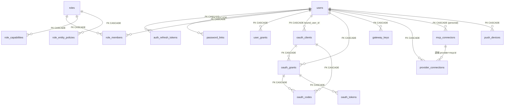
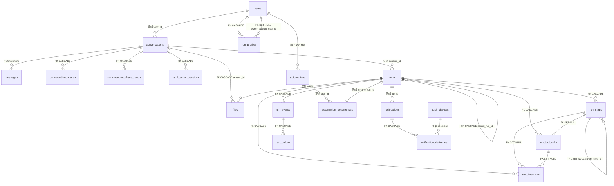
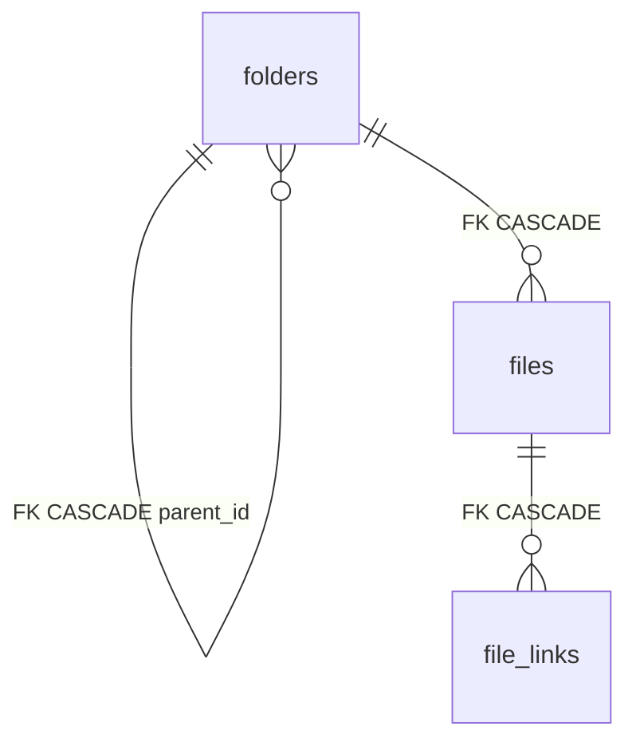
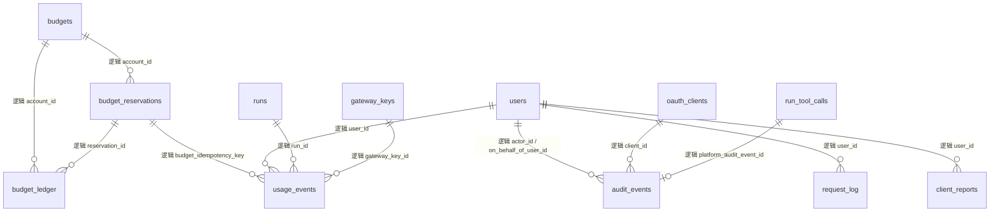

# 数据库结构（PostgreSQL，4.0 核心）

> 事实源：`packages/db/src/schema/*.ts`（每个域一个文件，文件头写着本域的表）。迁移链从 `packages/db/migrations/0000_v4_baseline.sql` 起步；3.x 的 0000–0009 归档在 `migrations/archive-3x/`，只供 3.x 库原地桥接。
>
> 核心 schema **50 张表**（含 `extension_migrations`；baseline 建 49 张，`0002_client_reports` 加 `client_reports`），新装只建这些；十个数据插件启用时各自建 24 张表（Example 另有 1 张）。字段类型、默认值、索引以 schema 与最新 snapshot 为准；本文只写用途、关键列和关系。

## 设计约定

- 主键一律 `text`。新行用 `newId(kind)`（`ids.ts`，类型前缀 + ULID，如 `doc_01J…`）；3.x 从 1.x 搬来的行保留原 id，整数是十进制字符串。id 是不透明键，不按形状判断任何事。
- 1.x 里是 serial 的表（会话、消息、项目、任务、文档……）新旧 id 混排，`ORDER BY id` 没有时间含义；按 `created_at`（或 `seq` / `position` / `sort_order`）排序。
- 边界（路由、工具、MCP）接受旧的数字 id：`toRowId()`（`@greenhouse/utils/id`）或 zod `z.coerce.string()` 规范成字符串。
- JSON 一律 `jsonb NOT NULL`，默认 `{}` / `[]`（`_columns.ts` 的 `json()`）；只有「null 本身有含义」才用可空的 `jsonOrNull()`。
- 时间点 `timestamptz`，按 ISO 字符串读；`created_at` / `updated_at` 为 `NOT NULL DEFAULT now()`。业务日期（项目 / 任务的 start / end / due）用 `date`（`YYYY-MM-DD`）。
- 枚举是 `text` + CHECK 约束（`oneOf()`），类型层同时用 `text(..., { enum })` 标注。
- 外键只用于同域强归属，并写明 `CASCADE` / `SET NULL`；审计、用量、通知、运行类表只存逻辑引用，主体删除后记录照留。
- 单组织：没有 organizations 表、没有 `org_id` 列。platform kernel 的 `ActorContext.orgId` 保留，宿主固定传 `'default'`。
- 一个概念一张表，合并来源用判别列区分（见「合并表与判别列」）。
- 软删分三种：`archived_at`（可见可恢复）、`deleted_at`（带回收站）、其余硬删 + 级联。
- 密钥在 `_enc` 列（AES-256-GCM，`PROVIDER_TOKEN_ENCRYPTION_KEY`）；令牌、授权码、网关 Key、设密链接只存 SHA-256。
- `messages.seq` 在锁定对应 `conversations` 行后分配，UK `(session_id, seq)` 兜底。
- 高增长表有保留期，由每日清理执行（见「保留期」）。

## 插件表归属

4.0 核心 schema 不管理这些表：各插件的 `0001_adopt.sql` 是它的基线，插件启用时才建表（`IF NOT EXISTS`）；从 3.x 桥接来的库里这些表已由 3.x 基线建好，同一文件原地认领。停用保留数据。

| 插件 | 表结构与关联 |
|---|---|
| Tables | [九张表与共享记录关联](../../../plugins/tables/db-schema.md) |
| email | [插件 schema](../../../plugins/email/db-schema.md) |
| feishu | [插件 schema](../../../plugins/feishu/db-schema.md) |
| memory | [插件 schema](../../../plugins/memory/db-schema.md) |
| feedback | [插件 schema](../../../plugins/feedback/db-schema.md) |
| reports | [插件 schema](../../../plugins/reports/db-schema.md) |
| skills | [插件 schema](../../../plugins/skills/db-schema.md) |
| projects | [插件 schema](../../../plugins/projects/db-schema.md) |
| computer | [插件 schema](../../../plugins/computer/db-schema.md) |

## 表目录

### 身份（identity.ts）

| 表 | 主键 / 唯一 | 用途与关键列 |
|---|---|---|
| `users` | PK `id`；UK `email` | 内部账号。`role` super / team（`external` 只出现在搬来的 disabled 行，鉴权拒绝）；`status` invited / active / reset_required / disabled；`auth_version` 凭证代数（改密、停用时递增，令牌与推送设备比对）；`locale`；`preferences` jsonb（字号 `fontScale`） |
| `auth_refresh_tokens` | PK `id` | 刷新令牌 hash、签发代数、过期时间；FK `user_id` CASCADE |
| `password_links` | PK `id`；UK `token_hash`；部分 UK `user_id`（未消费未撤销） | 邀请 / 重置设密链接，只存 token 的 SHA-256；`purpose`、`issued_auth_version`、过期 / 消费 / 撤销、邮件投递状态；`created_by` 逻辑 |
| `login_states` | PK `id`（= 值的 SHA-256） | 飞书 / 企微登录的待回调 `state` 与一次性登录码；`provider`、`kind` pending / login_code、`payload`、`expires_at`、`consumed_at` |
| `rate_limits` | PK `key` | 固定窗口计数，`key` = `<规则>:<主体>:<窗口起点 ms>`；`count`、`expires_at` |

### 权限（access.ts）

| 表 | 主键 / 唯一 | 用途与关键列 |
|---|---|---|
| `roles` | PK `id`；UK `code` | 角色；`status`、`system_protected` |
| `role_members` | PK `(role_id, user_id)` | 角色成员；两列都 FK CASCADE |
| `role_capabilities` | PK `(role_id, capability)` | 角色授予的能力（由核心与扩展 manifest 声明） |
| `role_entity_policies` | PK `id`；UK `(role_id, app_id, entity_id)` | 角色的实体策略：`scopes`（own / assigned / all）、`field_policies`；CRM 经 `db.platform` 求值 |
| `user_grants` | PK `(user_id, kind, key)` | 每成员开关：`kind=feature`（FEATURE_FLAGS 键，`enabled=false` = 显式关闭默认开启的 flag）/ `kind=tool`（可选工具，有行即授予）；`config` |

权限判定：角色 allow > 默认 deny。没有个人级能力 / 实体策略覆盖。

### 外部 Agent 与第三方连接（oauth.ts）

| 表 | 主键 / 唯一 | 用途与关键列 |
|---|---|---|
| `oauth_clients` | PK `id` | MCP / Agent 代理的 OAuth 2.1 客户端；`redirect_uris`、认证方式、`client_secret_hash`、`bound_user_id`（机器客户端代表的成员，FK CASCADE）、`allowed_scopes`、`status` |
| `oauth_grants` | PK `id`；UK `(user_id, client_id, resource)` | 成员对客户端的授权；`scopes`（实际授予，读时不放宽）、`status`、`avatar`（成员给这个 Agent 选的植物头像 `{plant, tint}`，null = 客户端默认） |
| `oauth_codes` | PK `code_hash` | 授权码（只存 hash）；PKCE S256、`redirect_uri`、`resource`、`scopes`、`used_at` |
| `oauth_tokens` | PK `id`；UK `token_hash` | access / refresh 令牌 hash；`resource`、`scopes`、过期 / 撤销 / 最近使用 |
| `gateway_keys` | PK `id`；UK `key_hash` | 成员的模型网关 Key；`key_prefix`、`allowed_models`（null = 全部）、过期、撤销（只打 `revoked_at`） |
| `provider_connections` | PK `id`；UK `(user_id, provider, workspace_id)` NULLS NOT DISTINCT | 成员与飞书 / 企微等的绑定；`access_token_enc` / `refresh_token_enc` / `credential_enc`（身份型绑定为 null）、`provider_user_id`（企微 UserId / 飞书 open_id，个人推送收件人与扫码登录查表键）、`metadata`；`provider = 'mcp:<连接器 id>'` 是成员自己的连接器 Key / 登录（AAD 绑定连接器与成员，`metadata` 带 status / last_error / last_verified_at） |

### 连接器（connectors.ts）

| 表 | 主键 / 唯一 | 用途与关键列 |
|---|---|---|
| `mcp_connectors` | PK `id`（`mcc_`）；UK `(scope, owner_user_id, slug)` NULLS NOT DISTINCT | `mcp_call` 调用的远端 MCP 服务器；`scope` team / personal（`owner_user_id` FK CASCADE，仅 personal）、`url`、`transport`、`auth_mode` none / shared / per_member + `auth_kind` key / oauth、Key 放置（`auth_header` / `auth_query_param` / `auth_value_prefix`）、`shared_secret_enc`（团队 Key 或团队登录 JSON，AAD `mcp:<id>:shared`）、`oauth_client_enc`（AAD `mcp:<id>:oauth-client`）、`oauth_discovery`、`private_network`（仅 team）、`allow_external_writes`、`tool_policy` `{工具: on/off}`、`vouched_read_only`、`tools`（上次刷新的工具缓存）、`last_error`、`enabled`、`catalog_id` |

### 对话（conversations.ts）

| 表 | 主键 / 唯一 | 用途与关键列 |
|---|---|---|
| `conversations` | PK `id` | 会话；`profile_id` 默认 `team`、`user_id`（逻辑）、`app_id`、`channel`（web / task / feishu / mobile…）、`metadata`；`pinned_at` + `pin_position` 为 owner 的置顶；`digest` / `digest_upto_seq` / `digest_updated_at` 滚动摘要 |
| `messages` | PK `id`；UK `(session_id, seq)`；部分 UK `(session_id, client_turn_id) WHERE client_turn_id IS NOT NULL` | 消息；`content` 为 Markdown 正文，`parts` jsonb `{references, images, pipeline}`（引用、图片、工具步骤与富卡片），`reasoning`、`model`、token 与耗时；`client_turn_id` 是客户端给 user 轮次的 id，重发同一轮被拒（`POST /api/chat` 409 `duplicate_turn`） |
| `conversation_shares` | PK `id`；UK `(session_id, shared_with)` | 会话共享；`shared_with` = 成员 id 或 `__team__` |
| `conversation_share_reads` | PK `id`；UK `(session_id, user_id)` | 收件人在共享会话上的状态：`read_at`，以及自己的置顶 `pinned_at` / `pin_position` |
| `card_action_receipts` | PK `id` | 卡片按钮的 exactly-once 回执（`tables_schema_plan` / `task_capture`）；`request_hash`、`status`、`result` |

### 运行（runs.ts）

Chat 与 Automation 共用的执行内核：Run / Step 走 version CAS，worker 用 `FOR UPDATE SKIP LOCKED` + lease 领取，状态变化与 Event + Outbox 同事务提交。`kind` 里 workflow / mission / subagent / eval 只剩历史行；`connector_write` 是 `mcp_call` 的写操作记录（`source_kind='connector_call'`，一条 Run + 一个 Step，不建 tool_call 行）。

| 表 | 主键 / 唯一 | 用途与关键列 |
|---|---|---|
| `runs` | PK `id`；UK `(kind, source_kind, source_id)`；部分 UK `(owner_user_id, kind, idempotency_key)` | 执行 envelope；主体 / 来源 / `parent_run_id` / `root_run_id`、`status`、`desired_state`、优先级与时限、lease / heartbeat、attempt、`input` / `output` / error、`version` |
| `run_steps` | PK `id`；UK `(run_id, step_key, attempt)` | 领取与重试单位；lease、用量（tokens / requests / cost_micros）、耗时 |
| `run_tool_calls` | PK `id`；部分 UK `(run_id, idempotency_key)` | 工具调用；完整参数 / 结果、`canonical_input_hash`、`risk_level`、`status`（含 `uncertain`）、`interrupt_id` / `platform_audit_event_id`（逻辑） |
| `run_interrupts` | PK `id` | 审批、ask_user、预算、外部依赖、未知结果等外部决定；`assignee_user_id`、`decision`、`decided_by_user_id` |
| `run_events` | PK `id`；UK `(run_id, seq)`；部分 UK `(run_id, idempotency_key)` | append-only 时间线；`seq` 锁 Run 后分配；`step_id` / `actor_user_id` 逻辑 |
| `run_outbox` | PK `id`；UK `(event_id, topic)` | Event 的投递状态；lease、attempts、dead_letter |

运行产出的文件在 `files`（`source='run'`）。

### 自动化与 Agent 配置（automations.ts）

| 表 | 主键 / 唯一 | 用途与关键列 |
|---|---|---|
| `automations` | PK `id` | 成员的定时任务；`profile_id`、`task_prompt`、cron `schedule` + `timezone`、`notify` jsonb `{webhook, email, wecom, feishu}`、`quiet_when_empty`、`unattended_tools`、`last_status` / `next_run_at` / `run_count` |
| `automation_occurrences` | PK `runtime_run_id` | 自动化 Run 终态的一次性投影（幂等键 = run id）；`task_id` / `owner_user_id` 逻辑 |
| `run_profiles` | PK `id`；UK `(user_id, slug)` | 成员的自定义 Agent（`custom:<id>`）：`base_profile_id`、`model_id`、`tools`、`system_prompt`、`is_shared`（只有 super 能开）、`avatar`、purpose / audience / `risk_level` / `budget_policy`、`owner_backup_user_id`（FK SET NULL）；`version` 只计编辑次数，`custom:<id>@<n>` 解析到当前配置；`connectors`（连接器 id 数组，null = 全部，只收窄） |

### Knowledge 插件

两张文档表与全文检索见 [Knowledge schema](../../../plugins/knowledge/db-schema.md)。核心只保留通用目录、文件与分享。

### 目录、文件与共享（files.ts）

| 表 | 主键 / 唯一 | 用途与关键列 |
|---|---|---|
| `folders` | PK `id` | 每个 scope 一棵树：`kb`（`visibility` + `owner_user_id`）、`tables`（`base_id`）、扩展 scope（`owner_key`，由扩展鉴权）；`parent_id` 自引用 CASCADE；`sort_order`（0 = 没手排过）。形状由已启用 scope 的注册表校验 |
| `files` | PK `id`；部分 UK `storage_key` | 所有存储对象的唯一登记处。`source`：`drive`（scope / folder / visibility / owner / base / owner_key）、`chat_upload` / `chat_output`（`session_id` FK CASCADE）、`run`（`run_id` 逻辑，`meta` 记方向 / kind / path / step）；`status` pending / active / failed / skipped / deleted；`size`、`sha256`、`storage_key`。CHECK `chk_files_source_owner` |
| `file_links` | PK `(file_id, target_type, target_id, slot)` | 附件关系；`target_type` table_record / message / task / kb_document（逻辑），`slot` = 表格字段 id 或 `''`；FK `file_id` CASCADE |
| `shares` | PK `id`；UK `(resource_type, resource_id, principal_type, principal_id)` NULLS NOT DISTINCT | 单独分享：`resource_type` kb_document / folder / file / table_base，`principal_type` user / team，`role` reader / editor（kb）或 owner / builder / editor / viewer（表格库） |

### 表格（官方插件）

九张表由 [Tables 插件](../../../plugins/tables/db-schema.md) 认领；核心 schema 不再导出它们。停用不删数据。

### 通知（notifications.ts）

| 表 | 主键 / 唯一 | 用途与关键列 |
|---|---|---|
| `notifications` | PK `id`；UK `(user_id, dedupe_key)` | 永久站内通知；`kind`、title / body / payload；`run_id` / `interrupt_id` / `event_id` / `agent_id` 逻辑；只改 `read_at` |
| `notification_deliveries` | PK `id`；UK `(notification_id, channel, recipient)` | 外部投递队列（desktop / wecom / feishu / email / mobile_push）；lease、retry、dead_letter、suppressed |
| `push_devices` | PK `id`；UK `token` | 手机推送设备；`platform`、`prefs`、`auth_version`、`last_seen_at`、`disabled_at` / `disabled_reason`（不物理删） |

### 用量与预算（usage.ts）

| 表 | 主键 / 唯一 | 用途与关键列 |
|---|---|---|
| `usage_events` | PK `id` | 一次计费调用一行。`kind`：`model`（模型调用，token）/ `service`（搜索、生图、云电脑分钟等）/ `audit`（`call_llm` 子调用的输入输出记录，无单位，不计花费）；`service`、`provider`、`model`、`profile_id`、`caller`、`units` + `unit_kind`、token 列、`cost_usd_micros`（null = 未定价）、`price_applied`、`client`、`oauth_client_id`、`gateway_key_id`、`session_id`、`run_id`、`budget_idempotency_key`、`detail` |
| `budgets` | PK `id`；部分 UK account `(scope_type, scope_id, unit, period_start, period_end)`、limit `(scope_type, scope_id, unit)` | `kind=account`：一个 scope 一个半开周期的硬额度余额（reserved / spent 只经账本变动）；`kind=limit`：管理员 USD 上限（organization / service / `user` + `*` 默认 / `user` + 成员 id），按月物化出 account |
| `budget_reservations` | PK `id`；UK `(account_id, idempotency_key)` | 预留；同一 `idempotency_key` 的多行是一个预留组（成员 + 组织 + 服务原子扣）；`request_hash`、estimated / actual、`expires_at` |
| `budget_ledger` | PK `id`；UK `(account_id, operation_key)` | append-only 账本；delta 与 after 余额 |
| `prices` | PK `id`；UK `(kind, target, provider)` | super 定的价，覆盖 models.yaml / services.yaml；每百万 token 价或 `unit_price` |
| `module_usage_daily` | PK `(day, kind, key, client)` | 每日模块计数（`tool_call` / `page_open`），不带成员与内容 |

### 客户端错误报告（client-reports.ts）

| 表 | 主键 / 唯一 | 用途与关键列 |
|---|---|---|
| `client_reports` | PK `id`；UK `(user_id, client_report_id)` | 成员的 App 交来的错误（`POST /api/client-reports`），super 在 Admin › 客户端错误按 `fingerprint`（名称 + 归一化消息）分组读；`fatal`、`source`（global / promise / boundary / window / unclean_exit）、`name`、`message`、`stack`、`route`（只有路径）、`platform`（ios / android / web / desktop）、`os_version`、`app_version`、`app_build`、`api_level`、`occurred_at`（设备时钟）；文本只存脱敏后的，不存正文与凭证 |

### 审计（audit.ts）

| 表 | 主键 / 唯一 | 用途与关键列 |
|---|---|---|
| `audit_events` | PK `id` | 唯一的「谁改了什么」流，操作记录读它。`app_id` 区分来源：platform 动作与云盘写入、`projects`（项目 / 任务动态）、`email`（`action_id='send'`，日发信限额数它的 success 行）、扩展 app；actor / on_behalf_of / client / request、module / entity / record、`capability`、`result`、`summary`（不存内容与密钥） |
| `request_log` | PK `id` | MCP（`a2a`）与 Agent 代理（`cli`）请求日志；`api` / `relay` 只是搬来的历史 |

### 其他

| 表 | 主键 / 唯一 | 用途与关键列 |
|---|---|---|
| `prompts` | PK `id`；UK `artifact_action_id` | 保存的任务 / Prompt（个人或 super 发布的全局）；`variables`、`expected_tools`（只展示）、`source_session_id`（逻辑）、`created_via` |
| `workspace_settings` | PK `key` | 管理员可改的部署设置；`value` jsonb 或 `value_enc` 密文 |
| `extension_migrations` | PK `(extension_id, name)` | 扩展/插件迁移车道的记账（带 checksum）；SDK 2 保留 `name=@onInstall`、`checksum=sdk2-install-v1` 记录成功安装，失败重试、停用保留；停用保留，`cli plugins drop <id> --yes` 仅删除该插件的表及此 lane 记录（事务 + RESTRICT） |

## 合并表与判别列

| 表 | 判别列 | 取值 |
|---|---|---|
| `files` | `source` | drive / chat_upload / chat_output / run |
| `usage_events` | `kind` | model / service / audit |
| `budgets` | `kind` | account / limit |
| `audit_events` | `app_id` | platform、projects、email、扩展 app… |
| `user_grants` | `kind` | feature / tool |
| `shares` | `resource_type` | kb_document / folder / file / table_base |
| `file_links` | `target_type` | table_record / message / task / kb_document |

## 保留期

每日清理（`services/retention.ts` + `apps/api/src/upkeep/retention.ts`）：

- `run_events`：已结算 Run 的事件 30 天，仍有未投递 outbox 的事件不删
- `run_outbox`：投递后 7 天
- `request_log`：30 天
- `budget_ledger`：13 个月
- `notification_deliveries`：终态后 7 天
- `client_reports`：90 天，且只留最新 10,000 行
- 过期凭证：`auth_refresh_tokens`、`oauth_codes`、`oauth_tokens`、`login_states`、`rate_limits`；`password_links` 过期 30 天后

其余表（会话、Run、通知、审计、用量事实）不自动删除。

## FK 约束总览

| 子表.列 | 父表.列 | onDelete |
|---|---|---|
| `auth_refresh_tokens.user_id` | `users.id` | CASCADE |
| `password_links.user_id` | `users.id` | CASCADE |
| `role_members.role_id` | `roles.id` | CASCADE |
| `role_members.user_id` | `users.id` | CASCADE |
| `role_capabilities.role_id` | `roles.id` | CASCADE |
| `role_entity_policies.role_id` | `roles.id` | CASCADE |
| `user_grants.user_id` | `users.id` | CASCADE |
| `oauth_clients.bound_user_id` | `users.id` | CASCADE |
| `oauth_grants.user_id` | `users.id` | CASCADE |
| `oauth_grants.client_id` | `oauth_clients.id` | CASCADE |
| `oauth_codes.grant_id` | `oauth_grants.id` | CASCADE |
| `oauth_codes.client_id` | `oauth_clients.id` | CASCADE |
| `oauth_tokens.grant_id` | `oauth_grants.id` | CASCADE |
| `gateway_keys.user_id` | `users.id` | CASCADE |
| `provider_connections.user_id` | `users.id` | CASCADE |
| `mcp_connectors.owner_user_id` | `users.id` | CASCADE |
| `messages.session_id` | `conversations.id` | CASCADE |
| `conversation_shares.session_id` | `conversations.id` | CASCADE |
| `conversation_share_reads.session_id` | `conversations.id` | CASCADE |
| `card_action_receipts.session_id` | `conversations.id` | CASCADE |
| `runs.parent_run_id` | `runs.id` | CASCADE |
| `run_steps.run_id` | `runs.id` | CASCADE |
| `run_steps.parent_step_id` | `run_steps.id` | SET NULL |
| `run_tool_calls.run_id` | `runs.id` | CASCADE |
| `run_tool_calls.step_id` | `run_steps.id` | SET NULL |
| `run_interrupts.run_id` | `runs.id` | CASCADE |
| `run_interrupts.step_id` | `run_steps.id` | SET NULL |
| `run_interrupts.tool_call_id` | `run_tool_calls.id` | SET NULL |
| `run_events.run_id` | `runs.id` | CASCADE |
| `run_outbox.event_id` | `run_events.id` | CASCADE |
| `automations.user_id` | `users.id` | CASCADE |
| `run_profiles.user_id` | `users.id` | CASCADE |
| `run_profiles.owner_backup_user_id` | `users.id` | SET NULL |
| `folders.parent_id` | `folders.id` | CASCADE |
| `files.folder_id` | `folders.id` | CASCADE |
| `files.session_id` | `conversations.id` | CASCADE |
| `file_links.file_id` | `files.id` | CASCADE |
| `notification_deliveries.notification_id` | `notifications.id` | CASCADE |
| `push_devices.user_id` | `users.id` | CASCADE |

## 逻辑关联总览（无 FK）

`created_by`、`updated_by`、`assigned_by`、`granted_by`、`shared_by`、`added_by`、`changed_by`、`revoked_by`、`decided_by_user_id` 等存 user id 的列一律视为到 `users.id` 的逻辑关联，下表不再逐条列出。

| 字段 | 逻辑目标 | 说明 |
|---|---|---|
| `conversations.user_id` | `users.id` | 成员删除后转录留作审计 |
| `conversation_shares.shared_with` / `conversation_share_reads.user_id` | `users.id` 或 `__team__` | 共享目标 |
| `card_action_receipts.user_id` | `users.id` | 点按钮的人 |
| `runs.owner_user_id` / `initiated_by_user_id` | `users.id` | 执行历史比主体长寿 |
| `runs.session_id` / `source_id` / `root_run_id` | `conversations.id` / 来源对象 / `runs.id` | 来源与根 |
| `run_events.step_id` / `actor_user_id` | `run_steps.id` / `users.id` | 保留原始标识 |
| `run_tool_calls.interrupt_id` / `platform_audit_event_id` | `run_interrupts.id` / `audit_events.id` | 反向链接与审计 |
| `run_interrupts.assignee_user_id` | `users.id` | 决定人 |
| `automation_occurrences.runtime_run_id` / `task_id` / `owner_user_id` | `runs.id` / `automations.id` / `users.id` | 历史比任务长寿 |
| `folders.owner_user_id` / `base_id` / `owner_key` | `users.id` / `table_bases.id` / 扩展对象 | 按 scope 三选一 |
| `files.owner_user_id` / `base_id` / `owner_key` / `run_id` | `users.id` / `table_bases.id` / 扩展对象 / `runs.id` | 按 source 与 scope |
| `file_links.target_id` | `table_records.id` / `messages.id` / `tasks.id` / `kb_documents.id` | 按 `target_type`；硬删目标的 service 负责删链接 |
| `shares.resource_id` / `principal_id` | 按 `resource_type` / `users.id` | 单独分享 |
| `notifications.user_id` / `run_id` / `interrupt_id` / `event_id` / `agent_id` | `users.id` / runs 域 / Agent 标识 | 通知比来源长寿 |
| `notification_deliveries.recipient` | 渠道收件人（`push_devices.id`、企微 UserId、邮箱…） | 按 `channel` |
| `usage_events.user_id` / `session_id` / `run_id` / `oauth_client_id` / `gateway_key_id` | 对应主体 | 用量事实独立保留 |
| `usage_events.budget_idempotency_key` | `budget_reservations.idempotency_key` | 结算键 |
| `budgets.(scope_type, scope_id)` | user / organization / agent / run / provider / service | 多态额度主体 |
| `budget_reservations.account_id` / `user_id` / `run_id` | `budgets.id` / `users.id` / `runs.id` | 预留审计不随主体删除 |
| `budget_ledger.account_id` / `reservation_id` | `budgets.id` / `budget_reservations.id` | append-only |
| `audit_events.actor_id` / `on_behalf_of_user_id` / `client_id` / `record_id` | 主体 / `users.id` / `oauth_clients.id` / 业务记录 | 审计比主体长寿 |
| `request_log.user_id` | `users.id` | 请求日志 |
| `client_reports.user_id` | `users.id` | 遥测，按保留期删 |
| `prompts.user_id` / `source_session_id` | `users.id` / `conversations.id` | 任务比来源会话长寿 |
| `provider_connections.provider`（`mcp:<id>`） | `mcp_connectors.id` | 成员的连接器凭证；改地址 / 认证方式与删除连接器时同一事务删除 |
| `runs.source_id`（`kind='connector_write'`） | `mcp_connectors.id` | 连接器写操作记录 |

## 关系图

`FK` 为数据库约束，`逻辑` 为应用层关联。按域拆图；完整清单以上面两张表为准。

### 身份、权限与外部 Agent

```mermaid
erDiagram
    users ||--o{ auth_refresh_tokens : "FK CASCADE"
    users ||--o{ password_links : "FK CASCADE"
    users ||--o{ role_members : "FK CASCADE"
    roles ||--o{ role_members : "FK CASCADE"
    roles ||--o{ role_capabilities : "FK CASCADE"
    roles ||--o{ role_entity_policies : "FK CASCADE"
    users ||--o{ user_grants : "FK CASCADE"
    users ||--o{ oauth_clients : "FK CASCADE bound_user_id"
    users ||--o{ oauth_grants : "FK CASCADE"
    oauth_clients ||--o{ oauth_grants : "FK CASCADE"
    oauth_grants ||--o{ oauth_codes : "FK CASCADE"
    oauth_clients ||--o{ oauth_codes : "FK CASCADE"
    oauth_grants ||--o{ oauth_tokens : "FK CASCADE"
    users ||--o{ gateway_keys : "FK CASCADE"
    users ||--o{ provider_connections : "FK CASCADE"
    users ||--o{ mcp_connectors : "FK CASCADE (personal)"
    mcp_connectors ||--o{ provider_connections : "逻辑 provider=mcp:id"
    users ||--o{ push_devices : "FK CASCADE"
```

### 对话、运行与自动化

```mermaid
erDiagram
    users ||--o{ conversations : "逻辑 user_id"
    conversations ||--o{ messages : "FK CASCADE"
    conversations ||--o{ conversation_shares : "FK CASCADE"
    conversations ||--o{ conversation_share_reads : "FK CASCADE"
    conversations ||--o{ card_action_receipts : "FK CASCADE"
    conversations ||--o{ files : "FK CASCADE session_id"
    conversations ||--o{ runs : "逻辑 session_id"
    runs ||--o{ runs : "FK CASCADE parent_run_id"
    runs ||--o{ run_steps : "FK CASCADE"
    run_steps ||--o{ run_steps : "FK SET NULL parent_step_id"
    runs ||--o{ run_tool_calls : "FK CASCADE"
    run_steps ||--o{ run_tool_calls : "FK SET NULL"
    runs ||--o{ run_interrupts : "FK CASCADE"
    run_steps ||--o{ run_interrupts : "FK SET NULL"
    run_tool_calls ||--o{ run_interrupts : "FK SET NULL"
    runs ||--o{ run_events : "FK CASCADE"
    run_events ||--o{ run_outbox : "FK CASCADE"
    runs ||--o{ files : "逻辑 run_id"
    users ||--o{ automations : "FK CASCADE"
    automations ||--o{ automation_occurrences : "逻辑 task_id"
    runs ||--|| automation_occurrences : "逻辑 runtime_run_id"
    users ||--o{ run_profiles : "FK CASCADE"
    users ||--o{ run_profiles : "FK SET NULL owner_backup_user_id"
    notifications ||--o{ notification_deliveries : "FK CASCADE"
    runs ||--o{ notifications : "逻辑 run_id"
    push_devices ||--o{ notification_deliveries : "逻辑 recipient"
```

### 内容：知识库、文件、项目、表格

```mermaid
erDiagram
    folders ||--o{ folders : "FK CASCADE parent_id"
    folders ||--o{ files : "FK CASCADE"
    files ||--o{ file_links : "FK CASCADE"
```

### 用量、预算与审计

```mermaid
erDiagram
    budgets ||--o{ budget_reservations : "逻辑 account_id"
    budgets ||--o{ budget_ledger : "逻辑 account_id"
    budget_reservations ||--o{ budget_ledger : "逻辑 reservation_id"
    budget_reservations ||--o{ usage_events : "逻辑 budget_idempotency_key"
    users ||--o{ usage_events : "逻辑 user_id"
    runs ||--o{ usage_events : "逻辑 run_id"
    gateway_keys ||--o{ usage_events : "逻辑 gateway_key_id"
    users ||--o{ audit_events : "逻辑 actor_id / on_behalf_of_user_id"
    oauth_clients ||--o{ audit_events : "逻辑 client_id"
    run_tool_calls ||--o| audit_events : "逻辑 platform_audit_event_id"
    users ||--o{ request_log : "逻辑 user_id"
    users ||--o{ client_reports : "逻辑 user_id"
```

## 全文搜索

- 核心会话与插件共用 `segmentForFts`；知识库的索引与检索规则由插件维护。
- 消息正文没有分词列：查询词分词后对 `content` 做 `strpos` 子串匹配。

## 维护检查

每次 schema 变化：

1. 改 `schema/*.ts`，在仓库根目录 `pnpm drizzle-kit generate`，审查 `packages/db/migrations/` 下生成的 SQL。
2. `./node_modules/.bin/drizzle-kit check` 校验 journal 与 snapshot。
3. `DATABASE_URL=<本地库> pnpm db:migrate` 应用，跑 `schema-equivalence.db-commit.test.ts`。
4. 更新本文的表目录、FK、逻辑关联与关系图；新表在 `ids.ts` 登记前缀。

### 官方通信插件表

邮箱表见 [Email schema](../../../plugins/email/db-schema.md)；飞书会话与回执表见 [Feishu schema](../../../plugins/feishu/db-schema.md)。企微使用核心身份表，没有私有表。通知 kind/channel 是开放文本，写入时由启用的核心/插件注册表校验；历史值读取不丢弃。

共享判别列 `shares.resource_type`、`file_links.target_type`、`folders.scope`、`audit_events.app_id`、`runs.kind` 在写入时按核心值 + 启用插件注册值校验；历史读取不裁剪。

卡片回执的 `kind` 同样由 `artifactKinds` 注册表校验新 claim，停用后历史回执仍可读取。

核心文件柜 scope 为 `drive`；Knowledge 启用时通过 driveScopes 选择原有 `kb` 文件柜。3.0.2 库桥接验证见 `tests/db/plugin-upgrade.db-commit.test.ts`（24 张插件表数据不变）与 `tests/db/schema-equivalence.db-commit.test.ts`（新装与桥接后 catalog 一致）。

### 4.0 客户端用量标签

`usage_events.client` 与 `module_usage_daily.client` 接受 `desktop`，由请求头 `X-Greenhouse-Client: desktop` 归因；网页仍为 web/web_chat，手机为 mobile。这些文本列不新增约束，不需要迁移。会话的持久化 channel 不随请求标签改变。内嵌插件凭证为短时签名，不落新表；沿用 users.auth_version 撤销。
